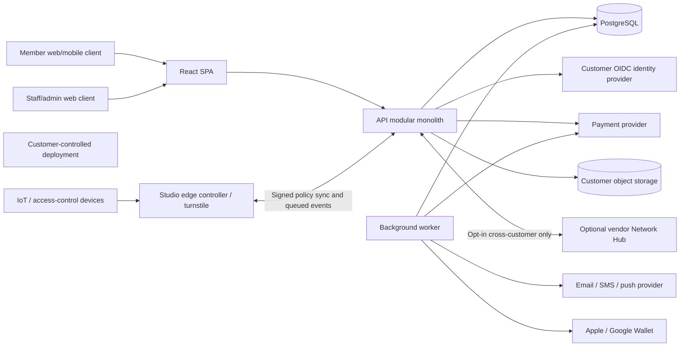

# Gym Studio Platform — Solution Architecture

**Status:** Proposed implementation baseline
**Audience:** Engineering, QA, Security, Operations, Customer IT
**Source of truth:** Product requirements in [`../product requirement/README.md`](../product%20requirement/README.md) and its Pillar 1–6 and Pillar 8 specifications.
**Purpose:** Translate the approved product requirements into an implementable target design. This document describes the target, not the current prototype.

## 1. Executive summary

Build the product as a **customer-deployed modular monolith** with a React web client, a TypeScript/Node.js API, PostgreSQL as the system of record, and a PostgreSQL-backed job runner. Keep domain modules independently structured behind application ports so they can be extracted only when scale or team ownership demonstrates a need. Ship services as containers; support a small-installation Docker Compose bundle and a Kubernetes/Helm deployment profile.

Each customer deployment is its own operational and data-sovereignty boundary. Within a deployment, records are scoped to studios and users are authorized for their assigned studios. Core gym operations must not require a vendor-hosted service. Cross-customer roaming is the explicit optional exception: it requires the separately licensed Network Hub described in Pillar 5 and Pillar 8.

The current repository is a prototype: React/TypeScript and Express/TypeScript are present, but the API currently uses NeDB, has no authentication or authorization middleware, performs non-transactional class capacity updates, and has no audit/outbox/production logging controls. Do not use those prototype behaviors as production requirements. PostgreSQL transactions, authorization, migrations, validation, and audit controls are foundation-phase work.

## 2. Requirements and architectural decisions

### 2.1 Requirements that drive the design

| Requirement | Architectural consequence |
|---|---|
| Customer owns hosting and production data | No mandatory vendor-hosted control plane; external services are ports/adapters and can be disabled or customer-operated. |
| Same product across cloud, on-premises, and air-gapped installs | Containerized services, configuration-only environment differences, documented external dependencies, offline license verification. |
| Member and turnstile access continues through WAN/vendor outages | Local edge verifier, signed entitlement cache, bounded offline operation, durable synchronization. |
| Booking/resource constraints and financial operations must be correct | PostgreSQL as authoritative store; atomic transactions, uniqueness/exclusion constraints, idempotency, append-only ledgers. |
| PII, waivers, and health-screening responses require protection | Data classification, least privilege, field-level protection for sensitive health data, redaction, access/change audit. |
| Integrations span payments, wallet passes, SMS/email, IoT, and aggregators | Provider-neutral interfaces; asynchronous delivery, retries, idempotent webhook handling, explicit integration status. |
| Independent customer deployment and updates | Versioned schema migrations, release bundles, pre-update backup, rollback runbook, data export format. |

### 2.2 Decisions

1. **Architecture style:** Modular monolith first; no microservices in the initial product.
2. **Primary database:** Self-hosted PostgreSQL Community Edition is the production system of record for operational, booking, membership, and financial state. PostgreSQL is open-source software distributed under the permissive PostgreSQL License and has no database license or per-seat fee. Do not require a paid database product or managed database service. A document-file database is not suitable for the required concurrency and transactional guarantees.
3. **Background work:** Durable PostgreSQL-backed queue (pg-boss or equivalent) for scheduled jobs and outbox dispatch. Avoid requiring Redis or Kafka for baseline operation.
4. **Identity:** OpenID Connect (OIDC) compatible identity provider; provide a customer-managed reference provider configuration. Enforce application authorization in the API regardless of IdP role claims.
5. **Service/API:** Node.js LTS, TypeScript strict mode, Express 5 (or a framework change only by ADR), REST/JSON API.
6. **Customer boundary:** One isolated deployment per customer; `studio_id` is still a mandatory data-access boundary within a deployment.
7. **Payments:** Hosted payment fields/redirect flow and provider tokens only; no raw card or bank-account data on platform servers.
8. **No silent data fallback:** Local browser storage may support explicitly labeled demo/read-only behavior, but it must not impersonate successful server-side mutations or become a production system of record.

These choices are a recommended baseline. Framework/provider selection for payment, identity, wallet, messaging, hardware, and object storage must be confirmed during the corresponding phase and recorded as ADRs before implementation.

## 3. System context and deployment topology



### 3.1 Deployment profiles

- **Developer/demo:** Docker Compose, local PostgreSQL, seeded demo data, fake payment/messaging adapters. Clearly mark demo mode and prohibit real member/financial data.
- **Single studio / small chain:** Docker Compose or equivalent container runtime, API and worker containers, PostgreSQL, customer-selected compatible object storage, TLS reverse proxy.
- **Enterprise/franchise:** Kubernetes/Helm, horizontally replicated stateless API/worker pods, managed or customer-operated PostgreSQL with HA/backups, external secrets manager, monitoring stack.
- **Air-gapped:** Preloaded signed image bundle, customer-provided OIDC and infrastructure or documented bundled equivalents, offline license file, local SMTP/SMS alternatives as configured, no required outbound telemetry.

All deployment profiles use the same application artifacts and database migrations. Differences belong in configuration and adapter selection, not conditional business logic.

### 3.2 Runtime components

| Component | Responsibility |
|---|---|
| Web SPA | Member and staff workflows; no authority for permissions, membership eligibility, capacity, or billing decisions. |
| API | Authenticated REST boundary; validates input, establishes studio/user context, calls use cases, returns stable API contracts. |
| Domain modules | Business rules and state transitions for members, enrollment, contracts, offerings, bookings, attendance, facilities, loyalty, network, and licensing. |
| PostgreSQL | Source of truth, transactional invariants, audit records, outbox, and job queue persistence. |
| Worker | Scheduled lifecycle jobs, outbox delivery, notification, reconciliation, settlement, integrations, and retryable workflows. |
| Edge controller | Local cryptographic access validation, encrypted bounded cache, local event queue, and eventual synchronization. It does not own membership billing or the authoritative ledger. |
| Object storage | Customer-controlled storage for photos, waiver/contract artifacts, exports, and backup payloads; metadata and hashes remain in PostgreSQL. |
| Reverse proxy / ingress | TLS termination, same-origin routing, request-size limits, security headers, and deployment-level rate limits. |

## 4. Clean architecture and code organization

### 4.1 Dependency rule

Dependencies point inward:

1. **Domain:** entities, value objects, policies, domain events. No Express, PostgreSQL, cloud SDK, or UI imports.
2. **Application:** use cases, command/query DTOs, authorization requirements, ports (interfaces), and transaction boundaries. Depends on Domain.
3. **Adapters / Infrastructure:** PostgreSQL repositories, payment and messaging clients, object storage, OIDC integration, queue, device protocols, logging. Implements application ports.
4. **Presentation:** Express routes/controllers, request schemas, response mapping, React UI. Calls application use cases; it does not contain core business rules.
5. **Composition root:** application startup wires concrete adapters and modules.

```text
api/src/
  app/                         # composition root, configuration, server lifecycle
  shared/
    domain/                    # shared IDs, clock, money, result/error types
    application/               # transaction, authorization, event, pagination ports
    infrastructure/
      postgres/                # pool, transaction manager, migrations
      logging/                 # Pino setup, redaction, request context
      queue/                   # worker and durable job setup
    http/                      # middleware, error mapping, API versioning
  modules/
    identity/
    studios/
    members/
    enrollment/
    memberships/
    offerings/
    bookings/
    attendance/
    facilities/
    payments/
    loyalty/
    network/
    licensing/
    reporting/
    <module>/
      domain/
      application/
      infrastructure/
      presentation/
      index.ts                 # exported module boundary
  workers/                     # job handlers composed from application use cases
```

The UI follows feature-based organization:

```text
ui/src/
  app/                         # routes, providers, app shell
  features/<feature>/
    api/                       # typed API calls
    components/
    hooks/
    pages/
    schemas/
    types/
  shared/
    api/                       # fetch client, Problem Details handling
    components/
    auth/
    design-system/
```

Module internals are private. A module may call another module through an application port or a published use case, never by reaching into its database tables/repository implementation. Do not create generic shared abstractions until at least two real consumers justify them.

### 4.2 Module ownership

| Module | Owns |
|---|---|
| Identity & access | External identity subject mapping, roles, studio assignments, permissions, sessions. |
| Studios & configuration | Customer deployment settings, studio/location records, hours, rules, theme, timezone. |
| Members & enrollment | Member profile, applications, waivers, health screening, identity verification references. |
| Memberships & billing | Plans, contracts, entitlements, freezes, plan changes, cancellation, invoices, payment attempts, dunning. |
| Offerings & resources | Offering catalog, instructors, zones, schedule templates, generated slots, capacity policy. |
| Bookings & attendance | Reservations, waitlists, promotion windows, check-in, no-show, access validation events. |
| Facilities | Assets, preventive maintenance, work orders, inspections, sanitation, telemetry. |
| Commerce | Retail inventory, POS transactions, PT credit packs, revenue ledger and reconciliation. |
| Loyalty & perks | Streaks, challenges, points ledger, referrals, partner perks and coupon redemption. |
| Network | Agreements, roaming eligibility, usage ledger, disputes, settlement batches; cross-customer messages only via optional Hub adapter. |
| Licensing & operations | Signed license verification, feature entitlements, deployment version, diagnostics, export/backup integration. |

Pillar sequence is the delivery order, not a reason to implement a separate service per pillar. The roadmap's Phase 0–6 gates remain the delivery baseline.

## 5. Design patterns and transaction model

- **Use-case/service layer:** One application handler per meaningful operation (e.g., `BookClass`, `FreezeMembership`, `RecordCheckIn`). It owns orchestration and authorization checks.
- **Repository pattern:** Domain-facing interfaces with PostgreSQL implementations. Repositories express aggregate operations, not generic CRUD for every table.
- **Ports and adapters:** Payment, identity, notifications, wallet, object storage, hardware, aggregator, and network hub integrations are interfaces with independently testable adapters.
- **Domain state machines:** Use explicit allowed transitions for enrollment, contracts, bookings, maintenance tickets, and settlement disputes. Reject invalid transitions with a typed domain error.
- **CQRS selectively:** Use separate read queries/projections where dashboards or search need efficient joins/aggregates. Do not introduce a separate event store or duplicate write model initially.
- **Transactional outbox:** Persist business state and outbound event/job in the same PostgreSQL transaction. Workers publish after commit and mark delivery; consumers are idempotent.
- **Idempotency:** Require idempotency keys for payment/booking/enrollment and external webhook operations that can be retried. Persist key, request hash, result reference, and expiry in the same transaction.
- **Optimistic concurrency:** Add `version` or use `updated_at`/ETag on user-editable records. Return `409 Conflict` for stale updates instead of overwriting newer changes.
- **Policies/specifications:** Encapsulate eligibility, cancellation cutoff, freeze limits, tier benefits, and license gates as named policies, testable without infrastructure.

### 5.1 Atomicity and concurrency rules

Every use case that mutates multiple records executes in one database transaction. Call external providers outside long-running database transactions. Use an outbox/saga workflow for payment confirmation, wallet provisioning, notification, refunds, and settlement transfers; each step is retryable and has a compensating action where possible.

| Operation | Required invariant |
|---|---|
| Booking | Capacity cannot be exceeded; unique active reservation per member/slot; waitlist position is deterministic. Lock the slot row or use a guarded atomic update and retry serialization conflicts. |
| Resource scheduling | Overlapping reservations for an exclusive zone/resource are rejected by a database exclusion constraint using time ranges, not only by UI validation. |
| Waitlist promotion | Claim the next eligible member atomically; promotion offer has an expiry; only one active offer per vacancy; expiration/cancellation cascades idempotently. |
| Membership/billing | Contract transition and invoice/payment-attempt references are consistent. Never mark paid from a client response; verify provider event/signature and reconcile. |
| Loyalty / financial adjustments | Append ledger entries; never edit balances as the only record. Derive or transactionally maintain cached balance from ledger entries. |
| Cross-studio settlement | Usage event is append-only; disputed line items are held individually; a transfer is idempotent and reconciled to provider settlement. |
| Check-in | Duplicate scans are idempotent within the configured window; local edge events use globally unique IDs and deduplicate on sync. |

## 6. Technology stack

The following is the recommended stack; versions must be pinned in lockfiles and deployment images and upgraded on a security cadence.

| Area | Recommendation | Notes |
|---|---|---|
| Runtime | Node.js 24 LTS, TypeScript strict mode | Align API, worker, and shared packages on one runtime/compiler policy. |
| API | Express 5, REST/JSON, OpenAPI 3.1 | Existing API uses Express 4; upgrade in a controlled API foundation change. |
| Validation | Zod (or equivalent schema library) | Validate all external input and environment configuration at boundaries. |
| Database | PostgreSQL Community Edition 17+ | Open-source and free to self-host; use customer-operated PostgreSQL as the default. A compatible managed PostgreSQL service is optional, not required, and may incur infrastructure/provider fees. Pin a tested major version. |
| Database access | `pg` + SQL-first repositories; versioned SQL migrations with `node-pg-migrate` or equivalent | Keep locking, exclusion constraints, indexes, and transaction semantics explicit. |
| Durable jobs | pg-boss or equivalent PostgreSQL-backed queue | Same HA/backup boundary as the primary database; keep handlers idempotent. |
| Web | React 19, TypeScript, Vite | Retain existing React/Vite SPA direction; use accessible component primitives/design system. |
| Authentication | OIDC provider; secure server-validated identity and session | Keycloak may be the reference self-hosted provider; support external OIDC providers. |
| Studio edge agent | Go (supported release), SQLite on encrypted local storage | Keep the verifier small and hardware-independent; test cryptographic/key storage against supported controller platforms. |
| Logging | Pino structured JSON | Redaction and correlation fields are mandatory. |
| Telemetry | OpenTelemetry SDK; Prometheus-compatible metrics/export; optional Grafana dashboards | Telemetry endpoints stay customer-controlled and are configurable/offline. |
| File/object storage | S3-compatible API via adapter, customer-owned endpoint | Files are private by default; use short-lived signed URLs where needed. |
| Packaging | OCI containers, Docker Compose, Helm | Same immutable images across deployment profiles. |
| Testing | Vitest or project-standard runner, Supertest, Playwright | Unit, integration, contract, concurrency, and end-to-end coverage. |

Do not select a provider-specific managed database, queue, secrets service, or telemetry SaaS as a hard runtime dependency. The reference Docker Compose installation must run using the PostgreSQL open-source distribution without a paid license. Provider adapters and optional deployment templates may use cloud-native services, but remain optional and may have separate infrastructure/service costs.

## 7. Data architecture

### 7.1 Relational model and persistence rules

Use normalized relational tables for operational state and explicit JSONB only for bounded, versioned configuration or provider payload snapshots. Store relationships by UUID; include `studio_id` on studio-owned rows and enforce scope in both application queries and database constraints where practical.

Core entities include:

- `deployment_instance`, `studio`, `user_identity`, `role_assignment`, `member`
- `membership_plan`, `membership_contract`, `contract_event`, `freeze_window`, `entitlement`
- `enrollment_application`, `waiver_version`, `waiver_acceptance`, `parq_submission`
- `offering`, `instructor`, `resource_zone`, `schedule_template`, `offering_slot`, `booking`, `waitlist_entry`
- `check_in`, `access_credential`, `edge_sync_event`
- `asset`, `maintenance_ticket`, `maintenance_task`, `inspection`, `sanitation_run`, `telemetry_event`
- `payment_method_reference`, `invoice`, `payment_attempt`, `refund`, `revenue_ledger_entry`
- `loyalty_ledger_entry`, `referral`, `merchant_perk`, `perk_redemption`
- `network_agreement`, `usage_ledger_entry`, `settlement_batch`, `settlement_line`, `dispute`
- `audit_event`, `outbox_event`, `idempotency_record`

Use database constraints for `NOT NULL`, enumerated state checks, uniqueness, foreign-key integrity, and non-overlap of exclusive resources. Every table has a primary key; high-write/large tables have indexes designed from measured query plans. Add `created_at` and `updated_at` to mutable records; immutable events have `occurred_at` and no update path.

### 7.2 Schema conventions

- SQL identifiers: `snake_case`; table names plural; column names descriptive (`member_id`, not `mid`).
- TypeScript: camelCase properties; map database names in repository code.
- IDs: UUID generated by a cryptographically secure UUID library; do not expose sequential database IDs.
- Time: UTC `timestamptz` for instants; `date` for calendar dates; store each studio's IANA timezone and calculate schedules in that timezone.
- Money: integer minor units (`amount_cents`) plus ISO 4217 currency. Never use floating-point arithmetic for money.
- Enumerations: uppercase stable values at API/domain boundary; database check constraint or reference table; never rely on UI labels.
- Soft deletion: only where retention/business rules need it; explicit `deleted_at` and audit event. Membership deletion/cancellation is not physical deletion by default.
- PII: separate profile/contact fields from sensitive health/identity evidence; use restricted repository methods and least-privilege database roles.
- Retention and purge: define per-data-class schedules, legal holds, export, and deletion/anonymization policies before production launch.

### 7.3 Sensitive evidence and files

Store files in customer-controlled private object storage, not in database blobs or public web paths. Use random object keys, malware scanning where applicable, content-type/size allowlists, short-lived signed access, and encryption at rest. Persist checksum, version, owner, sensitivity class, and retention metadata. Waiver/contract PDFs are immutable evidence; store the exact version, signature metadata, and SHA-256 content hash. PAR-Q responses are highly restricted health data: encrypt at the application field level using envelope encryption (AES-256-GCM with customer-controlled key management), restrict access by explicit permission, and do not duplicate answers into logs, analytics, or general member search.

The PRD's HIPAA/GDPR/CCPA references are design constraints, not proof of legal applicability or certification. Customer legal/compliance owners must determine jurisdiction, retention, consent, data-subject request, and processor obligations.

## 8. API and integration contracts

### 8.1 HTTP API

- Prefix all public endpoints with `/api/v1`; publish OpenAPI as a build artifact.
- Use resource-oriented routes and nouns: `GET /members`, `POST /bookings`, `POST /contracts/{id}/freezes`.
- All writes require authenticated identity, authorized studio context, schema validation, and appropriate idempotency/concurrency controls.
- Paginate collection endpoints with cursor pagination (`limit`, opaque `cursor`); cap page size; make sorting/filtering explicit and allowlisted.
- Use `application/problem+json` (RFC 9457) error bodies with stable `type`, `title`, `status`, `code`, `traceId`; never return stack traces or raw database/provider errors.
- Use consistent response semantics: `201` created, `202` accepted for asynchronous workflow, `204` successful no-content, `400` invalid input, `401` unauthenticated, `403` forbidden, `404` absent/out-of-scope, `409` state/concurrency conflict, `422` business-rule rejection, `429` rate limit.
- Enforce request body limits, content type, timeouts, CORS allowlist, security headers, and API rate limits at ingress and/or API middleware.
- Never trust a `studio_id`, `member_id`, price, role, or eligibility result solely because the browser supplied it.

### 8.2 Integrations

Wrap each external capability behind a typed port: `PaymentGateway`, `IdentityProvider`, `NotificationSender`, `WalletPassProvider`, `ObjectStore`, `AccessControlGateway`, `AggregatorClient`, `NetworkHubClient`. Each adapter must define timeout, retryability, idempotency, signature verification, data minimization, and health status.

Webhooks must verify provider signatures before processing, persist the provider event ID, deduplicate retries, and acknowledge only after durable acceptance. Do not retry permanent validation/authentication failures. External calls must not hold open user-facing database transactions. Use a circuit breaker only where it improves failure isolation; always expose degraded status instead of converting failures into success-shaped results.

Version public APIs and partner contracts. Use compatibility tests for webhook payloads and maintain an integration capability matrix for each deployment profile, including air-gapped restrictions.

## 9. Authentication, authorization, and security

### 9.1 Identity and access control

- Use OIDC Authorization Code + PKCE for browser authentication. Prefer same-origin secure `HttpOnly`, `Secure`, `SameSite` cookies for browser sessions; do not persist bearer/access tokens in `localStorage`.
- Require MFA for privileged staff/admin accounts; support customer IdP policies and session revocation.
- Use RBAC roles (platform/customer admin, studio manager, staff, trainer, member, auditor/support) plus studio-scoped permissions. Avoid a single broad `admin` role.
- Authorize every request at the use-case boundary. A user may access a member, booking, studio, or ledger only within explicitly assigned scope.
- Protect state-changing cookie-authenticated requests against CSRF. Enforce session expiration and reauthentication for high-risk actions.
- Log authorization denials as security events without including submitted secrets or health answers.

### 9.2 Security controls

- TLS 1.2+ for every network boundary; encrypt database, backup, and object storage at rest using customer-controlled keys where available.
- Secrets come from an environment-injected secret store/file or customer secrets manager; never commit `.env`, keys, tokens, license private keys, or production data.
- Vendor license signing private key stays outside product runtime; package only the trusted public verification key. Validate signature, SKU, expiry, feature flags, and seat/studio limits offline.
- Apply least-privilege service/database accounts, separate migration role from runtime role, and prohibit application DB role from updating/deleting audit/ledger tables.
- Use dependency scanning, container scanning, SBOM, signed release artifacts, and a security patch policy.
- Rate-limit login, enrollment, referral, check-in, and externally callable endpoints. Add abuse protection and anti-automation controls for public flows.
- Validate uploads, escape output, use parameterized SQL, and avoid dynamic SQL from request fields.
- Threat-model payment, member health data, wallet credentials, license tampering, turnstile spoofing, and partner webhook workflows before their phase gate.

## 10. PII auditing and transactional audit

### 10.1 Separate records by purpose

1. **Operational logs:** Diagnostics, not a record of legal/business truth. Redact PII and never store secrets, PAN/CVV, access tokens, signatures, or PAR-Q answers.
2. **Security/access logs:** Authentication, authorization, privileged action, credential, and suspicious-access metadata.
3. **Audit trail:** Who did what to which business record, when, in which studio, for what reason, and the result. Append-only and queryable for compliance/support.
4. **Business ledgers:** Payments, refunds, loyalty points, check-ins, usage/settlement, and inventory movements. Append-only facts with compensating entries rather than edits.

### 10.2 Audit event contract

Each `audit_event` should include:

```text
event_id, occurred_at, actor_type, actor_id, actor_role,
studio_id, action, subject_type, subject_id, outcome,
reason_code, correlation_id, source (web/api/edge/job),
changed_fields, before_redacted, after_redacted, schema_version
```

- Capture create/update/status transition, waiver and contract acceptance, payment/refund/adjustment, plan changes, check-in overrides, license changes, role changes, exports, and sensitive record reads.
- Do not include full before/after values for health responses, credentials, payment tokens, government IDs, or free-text notes. Prefer field names and safe state summaries. For sensitive reads, record that the record was accessed, not its contents.
- Record actor identity from the authenticated server context, never from a body field.
- Write the audit row in the same database transaction as the business mutation. If required audit persistence fails, fail the business transaction; never report success without its audit record.
- Restrict update/delete via DB privileges and repository API. Export audit records to customer-controlled append-only/WORM storage when tamper-evidence or retention requires it. Include hash chaining or signed batch manifests if a customer requires independent tamper detection.
- Define configurable retention, legal hold, and authorized export. Audit entries can themselves contain personal identifiers and require access controls and retention policy.

### 10.3 PII access and change auditing

Inventory data by class: public, internal, personal, sensitive personal/health, payment reference, and security credential. Minimize fields, mask in staff views, restrict bulk export, and audit sensitive reads/exports. Access to PAR-Q or identity-verification evidence requires a dedicated permission and a documented operational purpose. Build data-subject export, correction, and deletion/anonymization workflows without erasing records legally required for contracts, financial statements, fraud controls, or safety investigations; document the customer-configured retention/legal basis.

## 11. Transactional ledgers and financial correctness

- Represent invoice, payment attempt, refund, chargeback, credit, adjustment, inventory movement, points, and inter-studio usage as distinct immutable ledger events.
- Store amounts as integer minor units and currency; define rounding and tax behavior centrally per jurisdiction.
- Treat processor state as externally confirmed; webhook plus reconciliation establishes settlement. A timeout is **unknown/pending**, not failed or paid.
- Use idempotency keys and provider request references to prevent duplicate charges, refunds, promotions, redemptions, and payouts.
- Use a transactional outbox for follow-on notifications and workflows. Record every external request/response reference with redacted metadata and provider event IDs.
- Run daily reconciliation reports between internal invoice/payment/settlement data and provider reports. Differences create visible exceptions and must never be auto-corrected by silently changing ledger history.
- Corrections are compensating entries referencing the original event, actor, reason, and approval where required.
- Separate operational status from financial status: a membership cannot become `PAID` based only on a UI action; payment state follows verified processor events and policy.

## 12. Logging, monitoring, and operational observability

### 12.1 Logging framework and pattern

Use **Pino** for structured JSON logs in API and workers. One event per line; no ad-hoc `console.log` in production paths. Development may use a pretty transport, but production output remains machine-readable.

Required fields: `timestamp`, `level`, `service`, `version`, `environment`, `deployment_instance_id`, `request_id`/`trace_id`, `span_id` where available, `actor_id` only where justified and pseudonymized, `studio_id` where appropriate, `route`, `method`, `status_code`, `duration_ms`, `error_code`, and `event`.

- Establish correlation context at HTTP entry and propagate it to jobs, outbox events, and external calls.
- Redact request/response bodies by default. Explicitly allowlist safe fields; never log authorization/cookie headers, payment data, PAR-Q, waiver signature payloads, or uploaded content.
- Use stable event names such as `booking.created`, `payment.webhook.accepted`, `access.decision.denied`; do not log full user messages as event names.
- Log errors once at the layer with enough context; preserve typed cause internally, return safe public errors.
- Configure customer-controlled destinations, retention, rotation, and access controls. Do not transmit telemetry to vendor services unless explicitly opted in.

### 12.2 Metrics and tracing

Instrument with OpenTelemetry. Export metrics and traces only to configured customer endpoints. Track request latency/error rate, DB pool/slow queries, job queue age/retries/dead letters, booking conflicts, payment reconciliation variance, edge sync lag, turnstile decision latency/offline duration, backup age, license status, and release version. Avoid high-cardinality identifiers and PII labels.

Alert on operational symptoms (failed health check, queue backlog, backup missed, database capacity, edge cache nearing expiry, reconciliation exception), with customer-runbook links. The PRD's 99.95% availability and performance targets require production SLOs and measurement definitions; they are not guaranteed by the architecture alone.

## 13. Offline access and edge synchronization

The turnstile path must not depend on a remote vendor service and must satisfy the PRD's sub-300 ms decision and up-to-72-hour WAN-outage requirements.

1. A customer-controlled edge agent receives signed, time-bounded entitlement snapshots from the deployment and stores only the minimum token hash, status, expiry, and policy data required for verification in SQLite on encrypted local storage.
2. Encrypt the cache at rest; protect signing keys in hardware-backed storage where available. Use a vetted signature algorithm and key-rotation protocol selected in the access-control ADR. The application does not send raw member PII to the gate.
3. Each access credential is cryptographically verifiable, revocable, and rotatable. Scans produce a unique event ID, timestamp, controller ID, decision, and policy version.
4. During WAN outage, validate locally against cached signed entitlements and configured freshness limits; make the access/grace policy explicit to the customer. Keep safety-critical egress behavior independent of membership state.
5. Queue check-ins and diagnostics locally; synchronize at-least-once and deduplicate by event ID. Resolve conflicts by preserving the event and recording the reconciliation outcome, never by dropping a scan silently.
6. Monitor snapshot age, queue depth, clock drift, and device health. Alert before the cache's offline window expires.

Define key rotation, compromised credential revocation, stolen-device response, clock rollback handling, and local data purge in the access-control threat model. Any fail-open/fail-closed policy beyond the PRD's stated graceful access behavior requires a documented customer safety decision.

## 14. Frontend architecture and client behavior

- Use feature-based React modules, typed API clients, reusable accessible form controls, and a shared theme configuration for white-label branding.
- Keep server-owned state on the API; use a query/cache library only if adopted consistently, with explicit invalidation and error/loading/empty states.
- Validate for usability on client and repeat authoritative validation on server.
- Render permissions from API capabilities for user experience, but rely on API authorization for security.
- Keep session credentials out of browser storage; avoid persisting sensitive member data in IndexedDB/local storage.
- Local cache is a bounded convenience for non-sensitive, non-authoritative reads and demo mode. Offline write queues are allowed only for explicitly specified workflows with idempotency, conflict handling, user-visible pending state, and audited reconciliation.
- Accessibility target: WCAG 2.2 AA for member/staff critical flows; keyboard navigation, labels, contrast, focus handling, and screen-reader status messages.
- White-label assets/colors/fonts are validated configuration, not arbitrary executable code.

## 15. Background workflows and domain events

Use durable jobs with retry policies, exponential backoff with jitter, maximum attempts, dead-letter visibility, and operator replay procedures. Every handler must be safe to execute more than once.

Examples:

- Enrollment completion → verified payment event → activate contract → provision wallet pass → send welcome communication.
- Billing anchor date → create invoice → request processor charge → process verified webhook → update payment status or begin dunning.
- Freeze end/reminder, scheduled downgrade, cancellation effective date, and dunning retries.
- Schedule generation, cancellation cutoff, waitlist offer expiry/cascade, no-show assessment.
- Maintenance SLA escalation, preventive maintenance generation, sanitation reminders.
- Loyalty/streak calculation and expiration, referral attribution and reward issuance.
- Usage settlement batch, dispute window, provider payout, and reconciliation.
- Backup verification, license status notification, and diagnostic bundle generation.

Persist job/outbox status, attempts, last error code, next-attempt timestamp, and correlation ID. Alert on poison jobs; do not silently discard terminal failures.

## 16. Naming and coding standards

### 16.1 Naming conventions

| Artifact | Convention | Example |
|---|---|---|
| TypeScript files | `kebab-case.ts` for modules/utilities; React components `PascalCase.tsx` | `book-class.ts`, `MemberProfile.tsx` |
| Classes/types/interfaces | `PascalCase`; interfaces describe contracts, avoid `I` prefix | `BookClass`, `PaymentGateway` |
| Functions/variables | `camelCase`, verb-first for operations | `createBooking`, `waitlistPosition` |
| Constants | `UPPER_SNAKE_CASE` only for true module-level constants | `MAX_PAGE_SIZE` |
| Database | `snake_case`, plural tables, explicit foreign-key names | `membership_contracts`, `studio_id` |
| API | plural resource nouns, lowercase kebab only where needed | `/api/v1/membership-contracts` |
| Events/jobs | `domain.past_tense` event names, action-oriented handler names | `booking.created`, `promote-waitlist-entry` |
| Tests | mirror subject and behavior | `book-class.test.ts`, `booking.capacity.spec.ts` |
| Environment variables | `UPPER_SNAKE_CASE`, validated at startup | `DATABASE_URL`, `OIDC_ISSUER_URL` |

### 16.2 TypeScript and implementation rules

- Enable `strict`, `noImplicitOverride`, `noUncheckedIndexedAccess` where practical, and type-check both app and tests.
- Avoid `any`, unchecked casts, non-null assertions, and broad `catch` blocks. Narrow unknown errors and map known failures explicitly.
- Do not return success-shaped fallbacks when a server mutation failed. Surface safe actionable errors and preserve failure state.
- Keep functions focused; business logic has no HTTP/database imports. Prefer explicit DTOs at boundaries over leaking persistence rows.
- Use async/await and typed results/errors; never ignore rejected promises.
- Validate environment configuration once during startup; fail fast with a redacted, actionable configuration error.
- Keep comments for non-obvious invariants and security-sensitive behavior, not to narrate code.
- Use formatter/linter consistently, no committed generated build output unless release process requires it.

### 16.3 Error taxonomy

Use typed domain/application errors (`NotFound`, `Forbidden`, `Conflict`, `Validation`, `DependencyUnavailable`, `InvariantViolation`). Translate these at the HTTP boundary to stable codes and safe messages. Unexpected errors are logged with trace context and returned as generic `500`; database/provider internals never reach clients.

## 17. Testing and quality gates

1. **Unit tests:** Domain policies, state transitions, price/entitlement calculation, date/time edge cases, license verification, and redaction.
2. **Application tests:** Use cases with fake ports; assert authorization, transactions, idempotency, audit, and emitted outbox events.
3. **Database integration tests:** Real PostgreSQL in CI; verify migrations, constraints, transaction rollback, uniqueness, exclusion constraints, locking, and concurrent booking/waitlist behavior.
4. **Contract tests:** OpenAPI compatibility, OIDC claims mapping, payment and aggregator webhooks, notification and wallet adapters.
5. **End-to-end tests:** Enrollment, freeze/upgrade/cancel, capacity/waitlist, check-in, maintenance tickets, loyalty redemption, and license expiry behavior.
6. **Resilience tests:** Payment timeout/duplicate webhook, job replay, database failover, edge WAN outage up to 72 hours, clock drift, backup restore, and update rollback.
7. **Security tests:** Authz boundary tests, tenant/studio isolation, CSRF, rate limits, secret/PII log assertions, upload validation, dependency/container scans.

CI required checks: formatting/lint, typecheck, unit and focused integration tests, migration validation, build, dependency/security scan, container build, SBOM, and deployment smoke test. The roadmap's target is <10-minute CI feedback for the foundation pipeline; longer resilience/performance suites may run as separate required release gates.

## 18. Deployment, configuration, backup, and release

- Configuration is injected at runtime; keep secrets separate from ordinary feature/config values. Validate all required values at startup.
- Publish OCI images by semantic version and immutable digest; sign release artifacts and provide SBOM/changelog/migration notes.
- Support readiness/liveness endpoints separately. Readiness includes database/migration compatibility; liveness must not create restart loops for transient provider outages.
- Run database migrations as a controlled release step using a migration principal, not concurrently from every API replica. Prefer expand/contract migrations for rolling updates.
- Before updates, take and verify a customer-controlled backup; block destructive update on failed backup unless an authorized operator explicitly overrides with a recorded reason.
- Backup database, configuration, encryption-key recovery metadata, and object references/data according to customer RPO/RTO (PRD default RPO ≤24 hours, RTO ≤4 hours). Regularly test restores.
- Rollback includes application image and schema compatibility; irreversible migrations require forward-fix/restore plan. A database snapshot alone is not an adequate rollback design.
- Full export is versioned, documented, encrypted in transit, and includes members, contracts, bookings, financial/loyalty/network ledgers, and maintenance history.
- Support bundle contains only allowlisted sanitized logs, versions, status, and redacted configuration. Preview or document contents before customer sends it; no automatic vendor upload.
- License is validated locally from a signed file. Expiry may restrict administrative creation/configuration as licensed, but cannot block member access, check-in, or safety-critical workflows.

## 19. Phased engineering implementation

| Roadmap phase | Architecture deliverables |
|---|---|
| 0 — Foundation | Modular monolith skeleton; PostgreSQL migrations/repositories; studio/user identity model; OIDC/RBAC; containerized local stack; validated configuration; request IDs, Pino, basic OTel; CI and initial security model. |
| 1 — Enrollment | Member/application/waiver/PAR-Q data classes; payment hosted fields/provider adapter; audit/outbox; contract signature evidence and wallet workflow; private object storage. |
| 2 — Lifecycle & billing | Contract state machine, invoices/payments/immutable ledger, idempotent webhooks, dunning scheduler, reconciliation, freeze/upgrade/cancellation policies. |
| 3 — Offerings | Schedule and resource constraints in PostgreSQL; transaction-safe booking and waitlist; inventory and revenue ledger. |
| 4 — Facilities & IoT | Asset/ticket/inspection modules, device adapter, edge access cache, signed credential protocol, offline sync and outage drills. |
| 5 — Network & perks | Usage/loyalty ledgers, settlement workflow, partner integration contracts, optional Network Hub boundary, referral abuse controls. |
| 6 — Productization | Installer, Helm/Compose distributions, offline license, white-label configuration, backup/restore/export, diagnostics, update/rollback, clean-room install validation. |

Phase gates from the roadmap remain authoritative. Cross-cutting security, data privacy, operational KPI instrumentation, documentation, and pilot feedback are required in every phase, not deferred to Phase 6.

## 20. Decisions and requirements to close before implementation

The PRDs are broad and contain decisions that affect data model, legal risk, or deployment. Record an ADR or product decision before implementing each:

1. Initial production scope by phase and which PRD features are explicitly deferred.
2. Customer identity provider strategy, MFA policy, user provisioning, and account recovery.
3. Payment processor, supported currencies/taxes, ACH mandate handling, refunds, chargebacks, and financial retention.
4. Exact PII/health-data classifications, retention/deletion rules, legal basis, and jurisdiction-specific compliance obligations.
5. Studio timezone/DST rules, billing anchor proration, cancellation, freeze exceptions, and monetary rounding.
6. Waitlist tie-break/ranking, overbooking behavior, booking race handling, late-cancel/no-show penalties, and edge offline policy.
7. Member credential token format, cryptographic algorithms/key ownership/rotation, revocation SLA, and stale-cache policy for 72-hour outages.
8. Multi-location record ownership, access scope, settlement currencies/tax treatment, disputes, and Network Hub security/data-sharing contracts.
9. License expiry grace period, maximum offline license validity, feature gating, and emergency administrative recovery.
10. Supported PostgreSQL versions, object-store API compatibility, supported Kubernetes/container profiles, and minimum hardware sizing.
11. Availability/SLO measurement window, exclusions, alert ownership, recovery tests, and support bundle retention.
12. Accessibility conformance, supported browsers/devices, and mobile-app versus responsive-web scope.

Until resolved, implement only behind isolated policy/configuration boundaries and do not infer legally binding behavior from examples in the PRDs.

## 21. Current prototype gaps and migration guidance

The present scaffold is useful for UI demonstration, not production operation. Before real member or payment data is introduced:

- Replace NeDB persistence with self-hosted PostgreSQL Community Edition and versioned migrations. The database engine is open-source and has no license fee; the customer remains responsible for infrastructure, backup, and operation costs. The current `database/schema.sql` is illustrative and does not match the active document-store model.
- Add OIDC authentication, studio-scoped authorization, request validation, safe API errors, rate limits, and secret/config validation.
- Replace class `spotsLeft` read-modify-write with transactional booking records and database-enforced capacity constraints.
- Remove silent browser-local mutation fallback from production mode; only enable explicit demo behavior behind a build/runtime flag with non-production sample data.
- Add transactional audit/outbox, idempotency, financial ledgers, and webhook verification before billing and cross-system workflows.
- Replace `console` logging with Pino and add redaction/correlation; do not log request bodies or health data.
- Add integration tests using PostgreSQL and security/tenant-isolation tests before adopting prototype endpoints as contracts.
- Normalize the frontend/API domain vocabulary and create a generated or shared, versioned API contract rather than duplicating independently evolving types.

## 22. Reference product requirements

- [Master PRD and global NFRs](../product%20requirement/README.md)
- [Pillar 1 — Maintenance and facility operations](../product%20requirement/01_gym_studio_maintenance.md)
- [Pillar 2 — Offerings, scheduling, and retail](../product%20requirement/02_gym_studio_offerings.md)
- [Pillar 3 — Enrollment and onboarding](../product%20requirement/03_members_enrollment.md)
- [Pillar 4 — Membership lifecycle and billing](../product%20requirement/04_membership_maintenance.md)
- [Pillar 5 — Cross-gym collaboration](../product%20requirement/05_across_gym_collaboration.md)
- [Pillar 6 — Benefits, loyalty, and perks](../product%20requirement/06_members_benefits_and_perks.md)
- [Implementation roadmap](../product%20requirement/07_iterative_implementation_roadmap.md)
- [Pillar 8 — Productization and deployment](../product%20requirement/08_productization_licensing_deployment.md)
