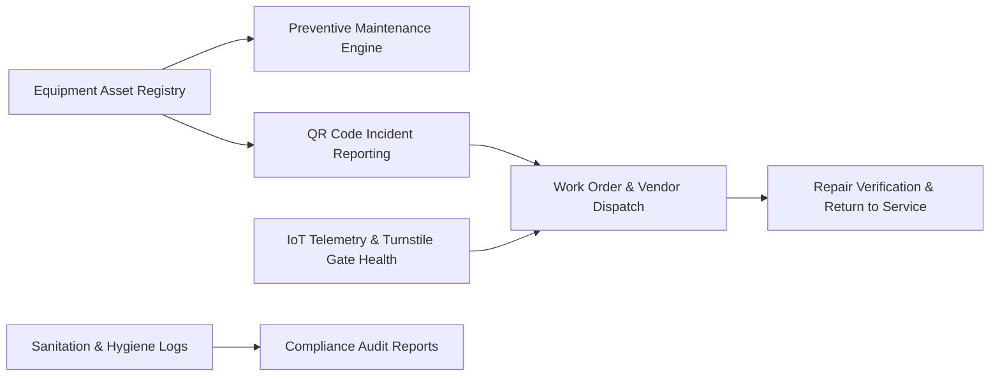

# Pillar 1: Gym Studio Maintenance & Facility Operations PRD

**Document Version:** 1.0.0  
**Domain:** Studio Facilities, Asset Management, IoT Telematics & Safety Compliance  
**Owner:** Senior Product Owner – Facilities & Operations  

---

## 1. Module Overview & Business Value

Equipment breakdowns, unsanitary facilities, and malfunctioning access gates represent the top drivers of member dissatisfaction and early membership cancellation in fitness studios. This module delivers an intelligent, predictive, and closed-loop facility operations engine.

### Key Objectives:
- Reduce Equipment Mean Time to Repair (MTTR) from 14 days to under 48 hours.
- Eliminate 90% of member frustration by providing transparent "Out of Order / Under Repair" statuses with real-time ETA in the member app.
- Digitize compliance, cleanliness audits, and vendor maintenance work orders.
- Guarantee 99.99% access control turnstile reliability with edge telemetry.

---

## 2. Core Functional Epics & Feature Specifications



### Epic 1.1: Asset Lifecycle & Equipment Registry
Studio managers and technicians must maintain a centralized inventory of all capital assets, fitness machinery, recovery equipment, and infrastructure.

#### Requirements:
1. **Asset Master Record:** Each asset record contains:
   - Unique Asset ID (UUID) and Human-Readable Tag (e.g., `TRD-04-ZONE-A`).
   - Category (Cardio, Strength, Recovery, Free Weights, Infrastructure/HVAC, Smart Gate).
   - Manufacturer, Model, Serial Number, Date of Commissioning, Purchase Cost.
   - Warranty Expiration Date, Service Contract Tier, Vendor Support SLA.
   - Current Physical Location (Zone, Floor, Room).
   - Operational Status: `Operational`, `Degraded`, `Out of Service`, `Under Maintenance`, `Decommissioned`.
2. **Digital Identity & Dynamic QR Tagging:**
   - The platform auto-generates unique weatherproof QR code labels for each machine.
   - Scanning the QR code displays context-aware views:
     - **For Members:** Machine name, instructional video on form, and a 1-tap "Report an Issue" button.
     - **For Staff/Technicians:** Maintenance history, pending tickets, warranty details, and a 1-tap "Log Service / Mark Out of Order" toggle.

---

### Epic 1.2: Preventive Maintenance (PM) & Telematics Engine
Automate scheduled servicing to prevent catastrophic machinery breakdowns and ensure member safety.

#### Requirements:
1. **Rule-Based PM Schedules:**
   - **Calendar-Based:** E.g., Weekly cable friction checks, monthly belt tensioning, quarterly motor brush inspections, semi-annual HVAC filter swaps.
   - **Usage-Based (IoT Connected):** Direct telemetry integration with smart cardio equipment (Matrix, LifeFitness, Woodway) tracking cumulative running hours and distance. When a treadmill reaches 1,000 operational hours, a PM ticket is auto-generated.
2. **Digital Inspection Checklists:**
   - Technicians receive structured step-by-step checklists on the staff mobile app (e.g., "Inspect belt alignment", "Lubricate deck", "Test emergency killswitch").
   - Mandatory photo evidence capture before a PM task can be marked `Completed`.

---

### Epic 1.3: Incident Management & Breakdown Work Orders
Fast-track incident resolution from the moment a defect occurs to resolution and return-to-service.

#### Requirements:
1. **Member Self-Report Workflow:**
   - Member scans equipment QR code -> selects issue category (e.g., *Snapped Cable*, *Slipping Belt*, *Screen Blank*, *Strange Noise*, *Unsanitary*) -> optional photo upload -> submits.
   - Duplicate ticket suppression: If a machine is already flagged as `Out of Service`, the member app displays: *"We are already on it! Technician dispatched (ETA: Tomorrow 11 AM)"* with a button to subscribe to SMS/Push notifications when fixed.
2. **Automated Triage & SLA Escalation:**
   - **Critical Severity (P1):** Immediate safety hazard (exposed high-voltage wire, snapped cable on loaded machine). Triggers instant SMS/push to General Manager and marks asset `Out of Service`.
   - **Major Severity (P2):** Core machine unusable (treadmill motor dead, display broken). 24-hour technician response SLA.
   - **Minor/Cosmetic (P3):** Worn vinyl padding, cup holder cracked. 7-day SLA.
3. **Vendor Dispatch & Spare Parts Tracking:**
   - Integration with external service contractors via automated email/webhook work order generation.
   - Track replacement parts consumption from studio inventory (e.g., replacement pulleys, safety keys, carabiners).

---

### Epic 1.4: Facility Hygiene, Sanitation & Air Quality Logs
Ensure studio hygiene compliance, clean locker rooms, and safe air quality.

#### Requirements:
1. **Time-Stamped Sanitation Runs:**
   - Staff execute digital cleaning routes every 60–120 minutes (Locker rooms, showers, dumbbell racks, refilling sanitizer stations).
   - NFC/Beacon checkpoints in locker rooms requiring physical presence verification before logging clean completion.
2. **Environmental & Air Quality Telemetry:**
   - Integration with IoT air monitors (CO2, PM2.5, Humidity, Temperature) in high-intensity studios (HIIT, Spin, Hot Yoga).
   - Automated alert triggers when CO2 levels exceed 1,000 ppm, automatically ramping up HVAC fresh-air exchange or alerting the front desk.

---

### Epic 1.5: Smart Access Control & Turnstile Hardware Health
Real-time heartbeat monitoring of smart turnstiles, speed gates, and magnetic door strikes.

#### Requirements:
1. **Hardware Heartbeat & Diagnostics:**
   - Access control edge controllers (e.g., Axis, HID, Shelly IoT relays) transmit ping heartbeats every 10 seconds.
   - Alert triggered if edge controller is unresponsive for > 60 seconds.
2. **Anti-Tailgating & Gate Jam Alarms:**
   - Photocell sensors detect multiple persons passing on a single scan.
   - Alerts front-desk dashboard with timestamped security camera snapshot.
3. **Local Offline Access Cache:**
   - Turnstiles store an encrypted local SQLite/Redis cache of all active member token hashes.
   - During broadband WAN outages, turnstiles continue granting access to active members without network lag.

---

## 3. Data Models & Schemas

### 3.1 Asset Record Schema (`Asset`)
```json
{
  "$schema": "https://json-schema.org/draft/2020-12/schema",
  "title": "Asset",
  "type": "object",
  "properties": {
    "assetId": { "type": "string", "format": "uuid" },
    "studioId": { "type": "string", "format": "uuid" },
    "tagCode": { "type": "string", "example": "TRD-04-CARDIO" },
    "category": { "type": "string", "enum": ["CARDIO", "STRENGTH", "RECOVERY", "INFRASTRUCTURE", "ACCESS_CONTROL"] },
    "make": { "type": "string", "example": "Life Fitness" },
    "model": { "type": "string", "example": "Integrity Series Treadmill" },
    "serialNumber": { "type": "string", "example": "LF-2024-998821" },
    "commissionDate": { "type": "string", "format": "date" },
    "warrantyExpiration": { "type": "string", "format": "date" },
    "status": { "type": "string", "enum": ["OPERATIONAL", "DEGRADED", "OUT_OF_SERVICE", "UNDER_MAINTENANCE"] },
    "locationZone": { "type": "string", "example": "Cardio Deck East" },
    "telematics": {
      "hasIoT": { "type": "boolean" },
      "totalRunHours": { "type": "number" },
      "lastHeartbeat": { "type": "string", "format": "date-time" }
    }
  },
  "required": ["assetId", "studioId", "tagCode", "category", "status"]
}
```

### 3.2 Maintenance Incident Ticket (`MaintenanceTicket`)
```json
{
  "ticketId": "tick_9941a",
  "assetId": "ast_4401a",
  "studioId": "std_101",
  "reportedBy": {
    "userId": "usr_member_442",
    "userType": "MEMBER"
  },
  "severity": "MAJOR",
  "issueType": "SLIPPING_BELT",
  "description": "Treadmill belt stutters when running over 8.0 mph",
  "photoUrls": ["https://cdn.gymstudio.com/tickets/photo1.jpg"],
  "status": "ASSIGNED",
  "assignedVendor": {
    "vendorId": "vnd_fitness_repairs_llc",
    "technicianName": "Carlos Mendoza",
    "scheduledVisit": "2026-10-06T10:00:00Z"
  },
  "createdAt": "2026-10-04T14:22:00Z",
  "targetResolutionAt": "2026-10-06T14:22:00Z"
}
```

---

## 4. User Stories & Acceptance Criteria (Gherkin Format)

### Scenario 1: Member Reports Broken Machine via QR Code
```gherkin
Feature: Equipment Breakdown Reporting
  As an active gym member
  I want to scan a machine's QR code and report a malfunction
  So that the gym staff is notified immediately and other members do not get injured

  Scenario: Successful member breakdown report with duplicate check
    Given I am authenticated in the member mobile app
    And I scan the QR code for asset "TRD-04-CARDIO" which is currently "OPERATIONAL"
    When I submit an issue with category "SLIPPING_BELT" and description "Stutters over 8mph"
    Then a new maintenance ticket with severity "MAJOR" should be created in the database
    And the asset status should automatically change to "DEGRADED"
    And the General Manager and Duty Tech should receive an in-app alert
    And I should see a confirmation screen saying "Thank you! Our maintenance team is on it."

  Scenario: Subsequent member scans machine already under repair
    Given the asset "TRD-04-CARDIO" is currently "OUT_OF_SERVICE"
    When another member scans the QR code for "TRD-04-CARDIO"
    Then the app should display "Machine Under Repair - Technician Dispatched (ETA: Tomorrow 10 AM)"
    And the app should offer a button "Notify me when fixed"
    And no duplicate incident ticket should be created
```

### Scenario 2: Turnstile Controller Offline Failover
```gherkin
Feature: Access Turnstile Offline Resilience
  As a gym operator
  I want turnstiles to function even when the studio loses internet connection
  So that active members are not locked outside the facility

  Scenario: Member scans digital NFC pass during internet outage
    Given the studio turnstile edge controller has lost WAN internet connectivity
    And the member "usr_8829" has an active membership stored in the turnstile's local cache
    When the member taps their NFC Apple Wallet pass on the turnstile reader
    Then the turnstile edge controller should validate the cached public key token
    And the turnstile gate barrier should unlock within 250 milliseconds
    And the access event should be logged to the offline queue
    And when WAN connectivity is restored, all queued attendance logs should synchronize to the cloud
```

---

## 5. Operational Dashboard & Reporting KPIs

1. **Equipment Availability Rate (%):**  
   $$\text{Availability} = \frac{\text{Total Operating Hours} - \text{Downtime Hours}}{\text{Total Operating Hours}} \times 100 \quad (\text{Target: } \ge 98.5\%)$$
2. **Mean Time to Repair (MTTR):** Average elapsed hours between ticket creation and certified return-to-service.
3. **Preventive vs Corrective Ratio:** Target is **$\ge 70\%$ preventive tasks** and **$\le 30\%$ breakdown emergencies**.
