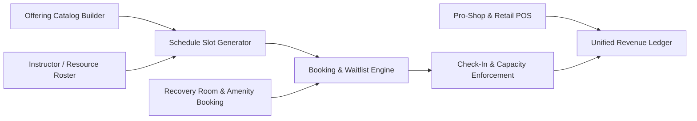

# Pillar 2: Gym Studio Offerings & Resource Engine PRD

**Document Version:** 1.0.0  
**Domain:** Group Fitness, Personal Training, Recovery Rooms, Pro-Shop Retail & Dynamic Workshops  
**Owner:** Senior Product Owner – Programming & Revenue Operations  

---

## 1. Module Overview & Business Value

A studio's offering catalog is its primary revenue and retention lever beyond base membership dues. This module unifies scheduling, resource allocation, instructor management, and ancillary retail into a single bookable commerce engine, eliminating the double-booking, overbooked waitlists, and disconnected point-of-sale (POS) systems that plague legacy studio software.

### Key Objectives:
- Achieve **≥ 85% average class fill rate** across peak time slots through dynamic waitlisting and predictive demand signals.
- Reduce instructor scheduling conflicts and no-shows to **< 2%** through automated substitute-finding workflows.
- Unify pro-shop retail, recovery suite bookings, and PT package sales under one point-of-sale and inventory ledger.
- Enable studios to launch limited-time workshops/pop-up events with zero engineering involvement (self-serve configuration).

---

## 2. Core Functional Epics & Feature Specifications



### Epic 2.1: Offering Catalog & Program Builder
Studio managers need a flexible no-code builder to define any bookable product: group classes, 1:1 / small-group PT, recovery suites (sauna, cryo, cold plunge, massage chairs), and time-bound workshops (nutrition seminars, Olympic lifting clinics).

#### Requirements:
1. **Offering Types:** `GROUP_CLASS`, `PERSONAL_TRAINING`, `SMALL_GROUP_TRAINING`, `RECOVERY_AMENITY`, `WORKSHOP_EVENT`, `RETAIL_PRODUCT`.
2. **Configurable Attributes per Offering:**
   - Name, description, cover image, intensity level (Low/Moderate/High), required equipment/zone.
   - Capacity (fixed headcount or resource-constrained, e.g., 1 sauna pod = capacity 4).
   - Duration, buffer/turnover time (e.g., 10-minute cleaning buffer between HIIT classes).
   - Pricing model: included-in-membership, credit-based, drop-in fee, or premium add-on surcharge.
   - Eligibility rules (tier-gated — e.g., only Platinum members can book the Infrared Sauna without a surcharge).
3. **Recurring Schedule Templates:** Managers define a weekly recurring template (e.g., "Spin — Mon/Wed/Fri 6:00 AM") which auto-generates individual bookable slots 8 weeks rolling forward, with holiday/blackout-date override support.

---

### Epic 2.2: Instructor & Resource Roster Management
1. **Instructor Profiles:** Certifications, specialties, bio, headshot, bookable availability windows, max weekly class load, hourly/per-head payroll split configuration.
2. **Substitute & Conflict Resolution Workflow:**
   - Instructor requests time off or flags inability to teach a scheduled slot.
   - Platform auto-broadcasts an open-shift notification to qualified substitute instructors matching the required specialty.
   - First-accept wins; booked members receive automatic "Instructor Update" push notification, never a silent swap.
3. **Resource/Zone Locking:** Prevents double-booking of physical zones (e.g., Studio B cannot host both "Yoga Flow" and "Bootcamp" simultaneously); the system blocks overlapping schedule creation at the data layer.

---

### Epic 2.3: Booking, Waitlist & Dynamic Capacity Engine
1. **Real-Time Booking:**
   - Members book via mobile app or kiosk; booking confirmation issued immediately with ICS calendar invite.
   - Overbooking buffer: managers may configure a controlled overbook percentage (e.g., 10%) to offset historical no-show rates.
2. **Smart Waitlist:**
   - When a class is full, members join a ranked waitlist. On a cancellation, the next waitlisted member is auto-promoted and notified with a **10-minute confirmation window** before cascading to the next person.
3. **No-Show & Late-Cancellation Policy Engine:**
   - Configurable cancellation cutoff (e.g., 4 hours pre-class). Late cancellations/no-shows deduct a class credit or apply a studio-configured fee, tracked against member reliability score.
4. **Capacity Enforcement at Check-In:** Front-desk kiosk or self-serve QR check-in validates the member has an active reservation before granting room access; walk-ins are only admitted if open capacity remains.

---

### Epic 2.4: Recovery Suite & Premium Amenity Booking
1. **Granular Time-Slice Booking:** Recovery amenities (sauna, cold plunge, percussion massage chairs, hyperbaric chambers) are bookable in 15/30-minute increments per individual pod/unit, distinct from group class capacity logic.
2. **Usage Caps & Fair-Access Rules:** Tier-based monthly usage caps (e.g., Silver = 2 sessions/month, Platinum = unlimited) enforced automatically at booking time with clear remaining-quota display.

---

### Epic 2.5: Pro-Shop Retail & Unified Point-of-Sale
1. **Inventory Catalog:** Apparel, supplements, accessories, and single-use items (towels, locks) with SKU-level stock tracking, low-stock reorder alerts, and vendor cost tracking for margin reporting.
2. **Unified Checkout:** Front-desk POS and member self-checkout kiosk support card-present (tap/chip), member wallet balance, and stored card-on-file payments, all reconciled into the same revenue ledger as membership dues and class fees.
3. **Bundled PT Package Sales:** Personal training sold as prepaid session packs (e.g., "10-Session Pack") that decrement a session-credit balance upon each completed PT booking, with expiration policies configurable per studio.

---

## 3. Data Models & Schemas

### 3.1 Offering Schema (`Offering`)
```json
{
  "$schema": "https://json-schema.org/draft/2020-12/schema",
  "title": "Offering",
  "type": "object",
  "properties": {
    "offeringId": { "type": "string", "format": "uuid" },
    "studioId": { "type": "string", "format": "uuid" },
    "type": { "type": "string", "enum": ["GROUP_CLASS", "PERSONAL_TRAINING", "SMALL_GROUP_TRAINING", "RECOVERY_AMENITY", "WORKSHOP_EVENT", "RETAIL_PRODUCT"] },
    "name": { "type": "string", "example": "Sunrise Power Spin" },
    "capacity": { "type": "integer", "example": 24 },
    "durationMinutes": { "type": "integer", "example": 45 },
    "bufferMinutes": { "type": "integer", "example": 10 },
    "pricingModel": { "type": "string", "enum": ["INCLUDED_IN_MEMBERSHIP", "CREDIT_BASED", "DROP_IN_FEE", "PREMIUM_SURCHARGE"] },
    "eligibleTiers": { "type": "array", "items": { "type": "string" }, "example": ["GOLD", "PLATINUM"] },
    "instructorId": { "type": "string", "format": "uuid" },
    "zoneId": { "type": "string", "example": "studio-b" }
  },
  "required": ["offeringId", "studioId", "type", "name", "capacity"]
}
```

### 3.2 Booking Record (`Booking`)
```json
{
  "bookingId": "bkg_77213",
  "offeringSlotId": "slot_2026-10-06T06:00:00Z",
  "memberId": "usr_member_442",
  "status": "CONFIRMED",
  "waitlistPosition": null,
  "checkInStatus": "NOT_ARRIVED",
  "cancellationPolicy": {
    "cutoffHours": 4,
    "lateFeeApplied": false
  },
  "createdAt": "2026-10-04T09:12:00Z"
}
```

---

## 4. User Stories & Acceptance Criteria (Gherkin Format)

### Scenario 1: Waitlist Cascade Promotion
```gherkin
Feature: Smart Waitlist Promotion
  As a member on a class waitlist
  I want to be automatically promoted when a spot opens
  So that I don't have to manually refresh the app repeatedly

  Scenario: Member cancels a full class triggering waitlist cascade
    Given the class "Sunrise Power Spin" is full with capacity 24
    And member "usr_5521" is ranked #1 on the waitlist
    When a confirmed member cancels their booking 5 hours before class start
    Then member "usr_5521" should receive a push notification offering the open spot
    And member "usr_5521" has 10 minutes to confirm before the offer cascades to waitlist rank #2
    And if confirmed, member "usr_5521" status should change to "CONFIRMED"
```

### Scenario 2: Recovery Suite Quota Enforcement
```gherkin
Feature: Recovery Amenity Monthly Quota
  As a Silver-tier member
  I want to be informed when I reach my monthly sauna quota
  So that I can decide whether to upgrade my membership or pay a drop-in surcharge

  Scenario: Member attempts to exceed monthly recovery quota
    Given the member's tier "SILVER" allows 2 complimentary sauna sessions per month
    And the member has already used 2 sessions this billing cycle
    When the member attempts to book a 3rd sauna session
    Then the app should display "You've used your 2 free sessions this month"
    And offer a drop-in surcharge payment option or an upgrade prompt to "GOLD" tier
```

---

## 5. Operational Dashboard & Reporting KPIs

1. **Class Fill Rate (%):** Booked seats ÷ total capacity, tracked per offering and time slot (Target: ≥ 85% peak slots).
2. **No-Show Rate (%):** Confirmed-but-absent bookings ÷ total confirmed bookings (Target: ≤ 8%).
3. **Revenue per Available Seat-Hour (RevPASH):** Total offering revenue ÷ (capacity × duration hours), analogous to hospitality RevPAR, used to optimize scheduling mix.
4. **Pro-Shop Gross Margin (%):** (Retail revenue − COGS) ÷ Retail revenue, tracked monthly per SKU category.
