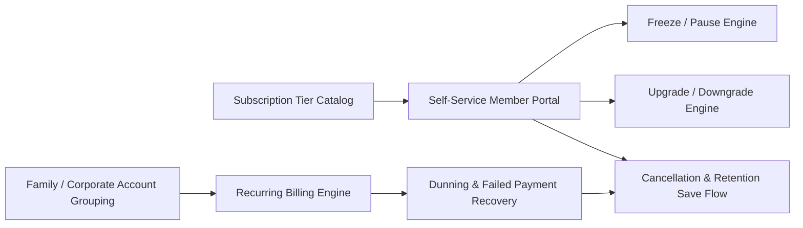

# Pillar 4: Membership Maintenance & Subscription Lifecycle PRD

**Document Version:** 1.0.0  
**Domain:** Subscription Tiers, Freeze/Pause, Upgrades/Downgrades, Cancellations, Dunning & Family/Corporate Accounts  
**Owner:** Senior Product Owner – Billing & Retention  

---

## 1. Module Overview & Business Value

Once enrolled, members need frictionless self-service control over their subscription lifecycle. Legacy gym software forces members to call or visit in-person for even trivial changes (e.g., pausing a membership during travel), generating enormous front-desk overhead and fueling frustration-driven cancellations. This module delivers a fully self-service subscription lifecycle engine backed by an automated dunning (failed-payment recovery) system.

### Key Objectives:
- Reduce annual member churn from the 35–45% industry baseline to **≤ 18%**.
- Cut front-desk administrative hours spent on billing/plan changes from 25 hrs/week to **≤ 6 hrs/week** per location.
- Recover **≥ 60% of failed payments** automatically through the dunning engine without manual collections calls.
- Support family and corporate multi-seat billing with a single consolidated invoice.

---

## 2. Core Functional Epics & Feature Specifications



### Epic 4.1: Subscription Tier Catalog & Contract Terms
1. **Tier Definitions:** Each tier defines included class credits, recovery amenity quotas, guest pass allotment, multi-location roaming rights, and cancellation notice period (month-to-month vs. annual commitment).
2. **Contract Term Types:** `MONTH_TO_MONTH`, `ANNUAL_COMMITMENT` (with early-termination fee schedule), `PREPAID_PACKAGE` (fixed session count, no recurring billing).
3. **Grandfathering & Price-Lock Rules:** Legacy pricing is preserved for existing members when catalog prices change, unless the member voluntarily switches tiers.

---

### Epic 4.2: Freeze / Pause Engine
1. **Self-Service Freeze Request:** Members can request a freeze (e.g., medical, travel, military deployment) directly from the app, selecting a start date and duration within studio-configured limits (e.g., max 3 months/year, minimum 2 weeks).
2. **Freeze Fee & Billing Suspension Rules:** Configurable: fully suspended billing, reduced "hold" fee, or unlimited free freezes for premium tiers. Medical freezes (with uploaded documentation) bypass standard duration caps.
3. **Automatic Resume:** Billing and access automatically resume on the scheduled end date with a pre-resume reminder notification 3 days prior.

---

### Epic 4.3: Upgrade / Downgrade & Plan Change Engine
1. **Mid-Cycle Upgrades:** Immediate tier upgrade with prorated charge for the remainder of the current billing cycle; new tier benefits (e.g., added class credits) are available instantly.
2. **Downgrade Scheduling:** Downgrades are scheduled to take effect at the **next renewal date** (not immediate) to prevent mid-cycle entitlement clawback disputes, with clear in-app messaging on the effective date.
3. **Add-On Marketplace:** Members can attach à la carte add-ons (extra guest passes, additional recovery credits, family member seat) without altering their base tier.

---

### Epic 4.4: Cancellation, Retention Save Flow & Exit Surveys
1. **Self-Service Cancellation Request:** Honors contractual notice periods (e.g., 30-day notice for annual plans); displays the exact effective cancellation date and any early-termination fee before confirmation.
2. **Automated Retention Offers:** Before finalizing cancellation, the flow presents a configurable save offer (e.g., one free freeze month, a discounted downgrade tier, or a pause-instead-of-cancel nudge) based on the member's stated cancellation reason.
3. **Exit Survey & Churn Reason Tagging:** Structured reason capture (price, relocation, injury, dissatisfaction, competitor switch) feeding the retention analytics dashboard.

---

### Epic 4.5: Recurring Billing, Dunning & Failed Payment Recovery
1. **Automated Recurring Charge Engine:** Charges the vaulted payment token on the billing anchor date; retries follow a smart cascading schedule (e.g., Day 0, Day 3, Day 7) with card-network "account updater" integration to silently refresh expired card BIN/expiry data.
2. **Dunning Communication Sequence:** Escalating but courteous email/SMS/push reminders at each retry stage, culminating in a grace-period access restriction (configurable, e.g., 7-day grace before access suspension) rather than immediate lockout.
3. **Involuntary Churn Recovery:** Members suspended for non-payment retain their account and history for a configurable window (e.g., 60 days) enabling 1-click reactivation once payment is resolved, rather than forcing full re-enrollment.

---

### Epic 4.6: Family & Corporate Multi-Seat Accounts
1. **Family Plan Grouping:** A primary billing account holder manages up to N linked family-member seats under one consolidated invoice, each with individual check-in credentials and class booking history.
2. **Corporate/Partner Billing:** Employer-sponsored accounts support either full-subsidy (employer pays 100%), partial-subsidy (split billing between employer and employee), or discount-only (employee pays full rate at negotiated price) models, with employer-facing utilization reporting.

---

## 3. Data Models & Schemas

### 3.1 Membership Contract (`MembershipContract`)
```json
{
  "$schema": "https://json-schema.org/draft/2020-12/schema",
  "title": "MembershipContract",
  "type": "object",
  "properties": {
    "contractId": { "type": "string", "format": "uuid" },
    "memberId": { "type": "string", "format": "uuid" },
    "tier": { "type": "string", "enum": ["BASIC", "GOLD", "PLATINUM"] },
    "termType": { "type": "string", "enum": ["MONTH_TO_MONTH", "ANNUAL_COMMITMENT", "PREPAID_PACKAGE"] },
    "billingAnchorDay": { "type": "integer", "example": 15 },
    "status": { "type": "string", "enum": ["ACTIVE", "FROZEN", "PAST_DUE", "SUSPENDED", "CANCELLED"] },
    "freezeWindows": {
      "type": "array",
      "items": {
        "startDate": { "type": "string", "format": "date" },
        "endDate": { "type": "string", "format": "date" },
        "reason": { "type": "string", "enum": ["TRAVEL", "MEDICAL", "MILITARY", "OTHER"] }
      }
    },
    "pendingDowngradeTier": { "type": ["string", "null"] },
    "familyGroupId": { "type": ["string", "null"], "format": "uuid" },
    "corporateSponsorId": { "type": ["string", "null"], "format": "uuid" }
  },
  "required": ["contractId", "memberId", "tier", "termType", "status"]
}
```

### 3.2 Dunning Attempt Log (`DunningAttempt`)
```json
{
  "attemptId": "dun_5521a",
  "contractId": "ctr_8821a",
  "attemptNumber": 2,
  "scheduledAt": "2026-10-07T08:00:00Z",
  "outcome": "FAILED",
  "failureCode": "insufficient_funds",
  "nextRetryAt": "2026-10-11T08:00:00Z",
  "accessRestrictionAppliedAt": null
}
```

---

## 4. User Stories & Acceptance Criteria (Gherkin Format)

### Scenario 1: Self-Service Membership Freeze
```gherkin
Feature: Membership Freeze Self-Service
  As an active member traveling abroad
  I want to pause my membership billing and access
  So that I don't pay for a month I can't use the gym

  Scenario: Member requests a valid travel freeze
    Given I am an active "GOLD" tier member with 0 freezes used this year
    When I request a freeze from "2026-11-01" to "2026-11-30"
    Then my contract status should change to "FROZEN" effective 2026-11-01
    And no billing charge should occur during the freeze window
    And I should receive a reminder notification 3 days before auto-resume
```

### Scenario 2: Dunning Recovery with Grace Period
```gherkin
Feature: Failed Payment Dunning Recovery
  As a studio operator
  I want failed payments to be retried automatically with member notifications
  So that we minimize involuntary churn without immediately locking out members

  Scenario: Card decline triggers retry cascade and grace period
    Given a member's recurring charge fails with "insufficient_funds" on the billing date
    When the dunning engine schedules retry attempts on Day 3 and Day 7
    And both retries also fail
    Then the member's contract status should change to "PAST_DUE"
    And the member should retain facility access during a 7-day grace period
    And if payment is not resolved by Day 7, contract status should change to "SUSPENDED"
    And the member should be able to reactivate within 60 days without re-enrollment
```

---

## 5. Operational Dashboard & Reporting KPIs

1. **Monthly Recurring Revenue (MRR) & Net Revenue Retention (%):** Tracks expansion (upgrades/add-ons) vs. contraction (downgrades/freezes) vs. churn.
2. **Voluntary vs. Involuntary Churn Split:** Target ≤ 18% annual voluntary churn; involuntary (payment-failure) churn recovery rate ≥ 60%.
3. **Freeze Utilization Rate:** % of active members using freeze benefit, correlated against retention outcomes to validate the retention-save hypothesis.
4. **Retention Save Offer Acceptance Rate (%):** % of cancellation-intent members who accept a save offer instead of cancelling.
