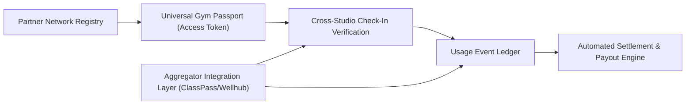

# Pillar 5: Across-Gym Collaboration & Clearinghouse PRD

**Document Version:** 1.0.0  
**Domain:** Multi-Location Roaming, Inter-Studio Financial Settlement, Partner Gym Networks & Aggregator APIs  
**Owner:** Senior Product Owner – Network & Partnerships  

---

## 1. Module Overview & Business Value

Members increasingly expect their membership to travel with them — whether roaming between a franchise's own locations, visiting reciprocal partner gyms, or accessing third-party aggregator networks (ClassPass, Wellhub/Gympass). Without an automated trust and settlement layer, cross-studio visits are either blocked entirely or require manual spreadsheet-based revenue reconciliation between locations. This module builds a real-time access-verification and automated financial clearinghouse so that any member can walk into any network location and have their visit instantly validated and fairly settled.

### Key Objectives:
- Grow cross-studio roaming visits from < 5% to **≥ 22%** of total network visits.
- Settle inter-studio usage fees automatically with **zero manual reconciliation**, closing the settlement cycle within **24 hours**.
- Onboard new partner/franchise locations to the network in **< 1 business day** via self-service partner portal.
- Integrate with at least one major third-party aggregator (ClassPass/Wellhub) with real-time two-way booking sync.

> **Deployment Model Note:** Since this platform is sold and deployed independently onto each customer's own infrastructure (see [`08_productization_licensing_deployment.md`](file:///c:/Source/antigravitytest/product%20requirement/08_productization_licensing_deployment.md)), Epics 5.1–5.3 natively cover roaming **within a single customer's own multi-location/franchise deployment** out of the box, with zero vendor-hosted dependency. True cross-*customer* roaming (e.g., independently-deployed Gym Chain A and Gym Chain B members roaming into each other's facilities) requires the optional, separately-licensed, vendor-hosted **Network Hub add-on** (Pillar 8, §6) that participating deployments opt into via the API/webhook layer. This is the one scenario in the entire platform that inherently cannot be fully self-hosted by a single customer, since it requires a shared rendezvous point between independently operated instances.

---

## 2. Core Functional Epics & Feature Specifications



### Epic 5.1: Partner Network Registry & Onboarding
1. **Network Tiering:** Distinguishes `OWNED_FRANCHISE` (same brand, shared back-office), `RECIPROCAL_PARTNER` (independent studio with a negotiated roaming agreement), and `AGGREGATOR_PARTNER` (ClassPass, Wellhub, corporate wellness platforms).
2. **Self-Service Partner Onboarding Portal:** A prospective partner studio registers location details, offering catalog, capacity rules, and settlement bank details; approval workflow activates the location into the roaming network within one business day.
3. **Reciprocity Rule Configuration:** Each partnership defines directional rules (e.g., "Studio A members may visit Studio B up to 4x/month free; Studio B members pay a $10 drop-in fee at Studio A") to support asymmetric partnership economics.

---

### Epic 5.2: Universal Gym Passport & Cross-Studio Access Verification
1. **Single Credential, Network-Wide Validity:** A member's existing digital wallet pass (from Pillar 3) is cryptographically valid across any network location without requiring a new sign-up or waiver re-signature — original studio's liability waiver is honored network-wide under a shared legal framework, or a lightweight supplemental waiver is auto-presented on first cross-visit.
2. **Real-Time Entitlement Check:** When a roaming member scans at a partner turnstile, the system performs a sub-300ms real-time entitlement lookup (tier eligibility, remaining monthly roaming visit quota, account standing) before granting access.
3. **Fallback for Network Outage:** If the home-studio entitlement service is unreachable, the visiting turnstile falls back to a cached "last known good" entitlement snapshot refreshed every 15 minutes, erring toward graceful access with post-hoc reconciliation rather than hard denial.

---

### Epic 5.3: Usage Event Ledger & Automated Settlement
1. **Immutable Usage Ledger:** Every cross-studio check-in, class booking, and recovery amenity usage generates an append-only ledger entry capturing home studio, visited studio, member, timestamp, and the applicable reciprocity rate.
2. **Automated Settlement Engine:** Nightly batch (or real-time streaming) settlement computes net payable amounts between studio pairs based on accumulated usage events and reciprocity rules, generating a transparent itemized statement.
3. **Payout & Invoicing:** Integrates with an ACH/wire payout provider (e.g., Stripe Connect, Adyen for Platforms) to automatically transfer net settlement amounts between studio operator accounts, with downloadable statements for accounting reconciliation.
4. **Dispute & Adjustment Workflow:** Either party can flag a usage event for dispute (e.g., duplicate scan, access-control malfunction) within a 7-day window before settlement finalizes; disputes pause only the contested line items, not the entire settlement batch.

---

### Epic 5.4: Third-Party Aggregator Integration Layer
1. **Two-Way Booking Sync:** Real-time API/webhook integration with aggregators so that aggregator-originated bookings reserve actual capacity in the studio's own schedule engine (Pillar 2), preventing overbooking conflicts between direct members and aggregator visitors.
2. **Aggregator Rate Card & Payout Reconciliation:** Studios configure the per-visit or per-class rate they accept from each aggregator; monthly aggregator payout statements are ingested and reconciled against the internal usage ledger to detect underpayment discrepancies.
3. **Capacity Throttling for Aggregator Visitors:** Studios may cap the percentage of class capacity made available to aggregator-sourced bookings (e.g., max 15% of seats) to protect the experience for core direct members.

---

## 3. Data Models & Schemas

### 3.1 Partner Network Agreement (`NetworkAgreement`)
```json
{
  "$schema": "https://json-schema.org/draft/2020-12/schema",
  "title": "NetworkAgreement",
  "type": "object",
  "properties": {
    "agreementId": { "type": "string", "format": "uuid" },
    "homeStudioId": { "type": "string", "format": "uuid" },
    "partnerStudioId": { "type": "string", "format": "uuid" },
    "networkType": { "type": "string", "enum": ["OWNED_FRANCHISE", "RECIPROCAL_PARTNER", "AGGREGATOR_PARTNER"] },
    "monthlyFreeVisitQuota": { "type": "integer", "example": 4 },
    "overQuotaFeeCents": { "type": "integer", "example": 1000 },
    "directional": { "type": "boolean", "example": true },
    "status": { "type": "string", "enum": ["PENDING_APPROVAL", "ACTIVE", "SUSPENDED"] }
  },
  "required": ["agreementId", "homeStudioId", "partnerStudioId", "networkType", "status"]
}
```

### 3.2 Cross-Studio Usage Ledger Entry (`UsageLedgerEntry`)
```json
{
  "ledgerEntryId": "ldg_99213",
  "memberId": "usr_member_442",
  "homeStudioId": "std_101",
  "visitedStudioId": "std_207",
  "eventType": "CHECK_IN",
  "appliedRateCents": 1000,
  "settlementBatchId": null,
  "disputeStatus": "NONE",
  "occurredAt": "2026-10-04T18:30:00Z"
}
```

---

## 4. User Stories & Acceptance Criteria (Gherkin Format)

### Scenario 1: Roaming Member Cross-Studio Check-In
```gherkin
Feature: Universal Gym Passport Cross-Studio Access
  As a traveling member
  I want to use my existing digital pass at a partner gym in another city
  So that I don't have to re-enroll or pay a full drop-in rate

  Scenario: Member visits a reciprocal partner studio within free quota
    Given member "usr_8829" belongs to home studio "std_101"
    And a reciprocal agreement exists allowing 4 free visits/month at partner studio "std_207"
    And the member has used 1 free visit so far this month
    When the member taps their wallet pass at studio "std_207" turnstile
    Then access should be granted within 300 milliseconds
    And a usage ledger entry should be created with appliedRateCents = 0
    And the member's free visit counter should increment to 2
```

### Scenario 2: Automated Nightly Settlement
```gherkin
Feature: Inter-Studio Automated Settlement
  As a studio operator
  I want cross-studio usage to be automatically settled without manual invoicing
  So that partner revenue sharing is accurate and timely

  Scenario: Nightly batch computes and pays out net settlement
    Given studio "std_207" recorded 12 billable roaming visits from studio "std_101" members this week
    And the applicable reciprocal rate is $10 per over-quota visit
    When the nightly settlement batch runs
    Then a settlement statement should be generated showing $120 payable from "std_101" to "std_207"
    And the payout should be transferred via the payments platform within 24 hours
    And both studios should receive a downloadable itemized statement
```

---

## 5. Operational Dashboard & Reporting KPIs

1. **Network Roaming Adoption Rate (%):** Cross-studio visits ÷ total network visits (Target: ≥ 22%).
2. **Settlement Cycle Time:** Hours from usage event to completed payout (Target: ≤ 24 hours).
3. **Dispute Rate (%):** Disputed ledger entries ÷ total ledger entries (Target: ≤ 1%).
4. **Aggregator Capacity Utilization:** % of aggregator-allocated seats filled vs. throttled cap, used to tune aggregator rate cards and capacity limits.
