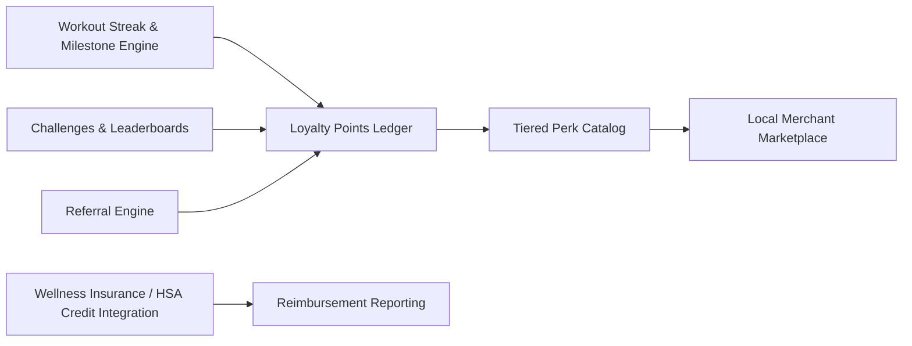

# Pillar 6: Members Benefits, Loyalty & Perks PRD

**Document Version:** 1.0.0  
**Domain:** Gamification, Tiered Loyalty Perks, Local Merchant Marketplace, Referral Engine & Wellness Insurance Credits  
**Owner:** Senior Product Owner – Retention & Community  

---

## 1. Module Overview & Business Value

Member retention is driven as much by emotional engagement and tangible perceived value as by facility quality. This module builds a gamified loyalty ecosystem that rewards consistency (streaks), deepens community belonging (challenges, leaderboards), and extends membership value beyond the gym's four walls through a local merchant perks marketplace and insurance/HSA wellness credit integrations.

### Key Objectives:
- Increase monthly perk/benefit engagement from < 10% to **≥ 45% monthly active engagement**.
- Improve 90-day new-member retention by **≥ 15 percentage points** via gamified streak and milestone mechanics.
- Launch a local merchant marketplace with **≥ 20 partner merchants per metro market** within the first two quarters post-launch.
- Drive **≥ 25% of new member acquisition** through the referral engine.

---

## 2. Core Functional Epics & Feature Specifications



### Epic 6.1: Workout Streak, Milestone & Gamification Engine
1. **Attendance Streak Tracking:** Automatically tracks consecutive-week or consecutive-visit streaks derived from turnstile check-in data (Pillar 1); displays visual streak counters and "streak at risk" nudges (e.g., "You haven't checked in this week — don't break your 12-week streak!").
2. **Milestone Badges:** Automated badge awards for cumulative milestones (First Class, 50 Visits, 1-Year Anniversary, 100 Classes Completed) displayed on the member's profile and shareable to social media.
3. **Challenges & Leaderboards:** Studio-run time-boxed challenges (e.g., "30-Day Squat Challenge") with opt-in leaderboards, scoring rules, and configurable prizes (points, merchandise, free PT session).

---

### Epic 6.2: Tiered Loyalty Points Ledger & Perk Catalog
1. **Points Accrual Rules:** Points earned from check-ins, class bookings, referrals, milestone achievements, and merchant marketplace purchases, with configurable point-value multipliers per activity type.
2. **Tiered Status Levels:** Bronze/Silver/Gold/Platinum loyalty status (distinct from membership subscription tier) driven by rolling 12-month points accumulation, unlocking escalating perks (priority class booking windows, complimentary guest passes, exclusive merchandise).
3. **Points Redemption Catalog:** Redeemable for studio credit (PT sessions, pro-shop items, recovery amenity passes) or merchant marketplace perks; full transaction history visible to members with expiration policy transparency (e.g., points expire after 18 months of account inactivity).

---

### Epic 6.3: Local Merchant & Wellness Brand Perks Marketplace
1. **Merchant Partner Onboarding:** Self-service merchant portal for local businesses (juice bars, physiotherapy clinics, athletic apparel shops, healthy meal-prep services) to list perks (percentage discount, BOGO, exclusive bundle) redeemable by studio members.
2. **QR/Digital Coupon Redemption:** Members browse the in-app perks marketplace and redeem a time-limited, single-use QR coupon at the merchant point-of-sale; redemption events are logged for merchant performance reporting and settlement if a revenue-share model applies.
3. **Geo-Relevant Perk Discovery:** Perks surfaced based on member's home studio location and recent check-in geography, prioritizing nearby/walkable merchant partners.

---

### Epic 6.4: Referral Engine
1. **Shareable Referral Links/Codes:** Each member receives a unique referral code/link; referred prospects who complete enrollment (Pillar 3) within a tracked attribution window (e.g., 30 days) trigger a reward for both referrer and referee ("Give $20, Get $20" style double-sided incentive).
2. **Fraud & Abuse Guardrails:** Rate-limiting and duplicate-household detection (shared payment fingerprint/address) prevent referral-reward farming.
3. **Referral Leaderboard & Social Proof:** Optional public leaderboard recognizing top community referrers per studio location, reinforcing community-driven growth loops.

---

### Epic 6.5: Wellness Insurance & HSA/FSA Credit Integration
1. **Insurance Wellness Program Integration:** Integration with payer wellness programs (e.g., Silver&Fit, SilverSneakers-style programs, employer-sponsored wellness stipends) to automatically apply eligible reimbursement credits against monthly dues.
2. **HSA/FSA Eligible Expense Documentation:** Auto-generates itemized receipts formatted for HSA/FSA reimbursement submission, flagging which line items (membership dues vs. retail merchandise) qualify under typical plan rules.
3. **Reimbursement Reporting Dashboard:** Members can view cumulative insurance-covered savings for the year, reinforcing perceived membership value at renewal time.

---

## 3. Data Models & Schemas

### 3.1 Loyalty Points Ledger Entry (`LoyaltyLedgerEntry`)
```json
{
  "$schema": "https://json-schema.org/draft/2020-12/schema",
  "title": "LoyaltyLedgerEntry",
  "type": "object",
  "properties": {
    "entryId": { "type": "string", "format": "uuid" },
    "memberId": { "type": "string", "format": "uuid" },
    "activityType": { "type": "string", "enum": ["CHECK_IN", "CLASS_BOOKING", "REFERRAL", "MILESTONE", "MERCHANT_PURCHASE", "REDEMPTION"] },
    "pointsDelta": { "type": "integer", "example": 25 },
    "balanceAfter": { "type": "integer", "example": 1340 },
    "expiresAt": { "type": ["string", "null"], "format": "date-time" },
    "createdAt": { "type": "string", "format": "date-time" }
  },
  "required": ["entryId", "memberId", "activityType", "pointsDelta"]
}
```

### 3.2 Merchant Perk Offer (`MerchantPerk`)
```json
{
  "perkId": "perk_7712a",
  "merchantName": "Greenleaf Juice Co.",
  "studioIdsEligible": ["std_101", "std_207"],
  "offerType": "PERCENT_DISCOUNT",
  "offerValue": 20,
  "redemptionLimitPerMember": 1,
  "validFrom": "2026-10-01",
  "validTo": "2026-12-31",
  "status": "ACTIVE"
}
```

---

## 4. User Stories & Acceptance Criteria (Gherkin Format)

### Scenario 1: Streak-at-Risk Nudge
```gherkin
Feature: Workout Streak Retention Nudge
  As a member with an active check-in streak
  I want to be reminded before my streak breaks
  So that I stay motivated to maintain consistent attendance

  Scenario: Member approaches end of week without a check-in
    Given member "usr_5521" has a 12-week consecutive check-in streak
    And it is Saturday evening with no check-in recorded this week
    When the streak monitoring job runs its daily evaluation
    Then the member should receive a push notification: "Don't break your 12-week streak!"
    And if no check-in occurs by end of day Sunday, the streak counter should reset to 0
```

### Scenario 2: Referral Reward Attribution
```gherkin
Feature: Double-Sided Referral Rewards
  As an existing member
  I want to earn a reward when my referral joins
  So that I'm incentivized to bring friends to the studio

  Scenario: Referred friend completes enrollment within attribution window
    Given member "usr_1001" shares their unique referral link with a friend
    And the friend completes enrollment using that link within 30 days
    When the friend's enrollment status becomes "COMPLETED"
    Then member "usr_1001" should receive 500 loyalty points (or $20 studio credit)
    And the referred friend should receive a matching $20 enrollment credit
    And the referral should be recorded as "CONVERTED" in the referral ledger
```

---

## 5. Operational Dashboard & Reporting KPIs

1. **Monthly Perk Engagement Rate (%):** Members redeeming at least one perk/benefit per month ÷ total active members (Target: ≥ 45%).
2. **90-Day Retention Lift from Gamification:** Cohort comparison of members opted into streaks/challenges vs. control group.
3. **Referral-Sourced Acquisition Share (%):** New members attributed to referral codes ÷ total new members (Target: ≥ 25%).
4. **Merchant Marketplace Density:** Active partner merchants per metro market (Target: ≥ 20 per market within 2 quarters).
