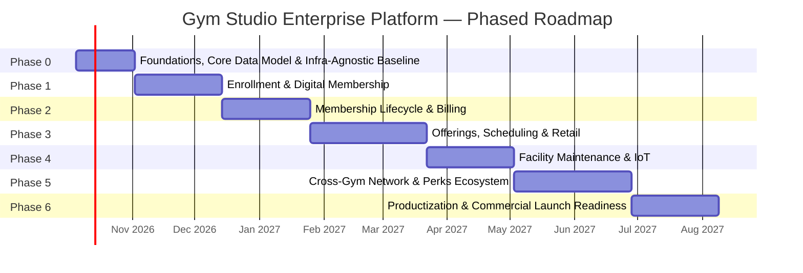

# Iterative Implementation Roadmap & Product Build Plan (Phase 0 – Phase 6)

**Document Version:** 2.0.0  
**Scope:** Phase-by-phase delivery plan spanning all six operational pillars (Maintenance, Offerings, Enrollment, Membership Maintenance, Cross-Gym Collaboration, Benefits & Perks) plus the commercialization pillar (Productization, Licensing & Customer-Deployed Operability)  
**Owner:** Senior Product Owner, in collaboration with Engineering Leads & Delivery Managers  
**Methodology:** Agile, 2-week sprints, phase gates reviewed by a cross-functional steering committee (Product, Engineering, Operations, Finance, Sales/GTM)  
**Commercial Context:** This platform is built to be **sold as a licensed product that customers deploy onto their own infrastructure** (see [`08_productization_licensing_deployment.md`](file:///c:/Source/antigravitytest/product%20requirement/08_productization_licensing_deployment.md)). This changes two things versus a typical hosted-SaaS roadmap: (1) infra-agnostic packaging must be baked into the **foundation** phase, not retrofitted later, and (2) a dedicated **commercial launch readiness phase** (Phase 6) gates the point at which the product can actually be handed to a paying customer's IT team.

---

## 1. Delivery Philosophy

The platform is built **iteratively, not big-bang**: each phase ships a usable, revenue-protecting or revenue-generating increment, validated with real studio operators before the next phase begins. Phases are sequenced so that foundational data models (members, studios, offerings) land first, core revenue/retention workflows land next, network-effect/ecosystem features (cross-gym collaboration, perks marketplace) land after that — since they depend on a critical mass of enrolled members and partner studios — and full commercial packaging/licensing lands last, once there is a feature-complete product worth wrapping and selling.

---

## 2. Phase 0: Foundations, Core Data Model & Infra-Agnostic Baseline (4 Weeks)

**Goal:** Establish the shared technical foundation every other pillar depends on — without this, no pillar can be built safely in parallel later. Critically, this phase also bakes in the **deployability architecture** from day one (Pillar 8, Epic 8.1), because retrofitting infra-agnosticism after five phases of cloud-specific shortcuts is far more expensive than designing for it up front.

### Scope:
- Core domain models: `Studio`, `Member`, `User/Role (RBAC)`, `Asset` (stub), `Offering` (stub).
- Authentication & authorization (member, staff, admin, franchise-owner roles).
- Base API gateway, database schema migrations, CI/CD pipeline, and environment provisioning (dev/staging/prod).
- Observability baseline: structured logging, error tracking, uptime monitoring.
- Design system / UI component library (glassmorphism theme per existing `ui/` scaffold).
- **Infra-agnostic packaging baseline (Pillar 8, Epic 8.1):** containerize every service from the first commit (no code that assumes a specific cloud-managed service without a documented self-hosted equivalent); establish the configuration-as-code pattern (environment variables/secrets, not hardcoded endpoints) that the Phase 6 installer will later wrap.

### Dependencies: None (first phase).

### Exit Criteria (Phase Gate):
- A studio admin can log in and view an empty but correctly modeled studio record.
- CI pipeline runs lint/test/build on every commit with < 10-minute feedback loop.
- Security review sign-off on auth/RBAC design before any payment or PII data flows are introduced.
- The full stack runs identically via `docker compose up` on a clean machine with no hardcoded cloud-provider dependency — proving the infra-agnostic baseline before any domain-specific feature work begins.

---

## 3. Phase 1: Members Enrollment & Digital Membership (6 Weeks)

**Goal:** Ship the highest-leverage conversion surface first — a working, revenue-capable sign-up flow — so studios can begin onboarding real paying members as early as possible.

### Scope (maps to Pillar 3):
- Plan catalog + pricing engine (Epic 3.2).
- Digital waiver + PAR-Q e-signature capture (Epic 3.3).
- Payment tokenization & vaulting via a PCI-compliant processor (Epic 3.5).
- Contract e-signature + digital wallet pass (Apple/Google Wallet) provisioning (Epic 3.6).
- Basic admin member directory (search/filter/create/edit) — already partially reflected in the existing `ui`/`api` scaffold's Members module.

### Dependencies: Phase 0 data model and auth.

### Exit Criteria:
- End-to-end digital enrollment completes in under 3 minutes in usability testing.
- A real wallet pass is installable and scannable on both iOS and Android test devices.
- First pilot studio successfully enrolls ≥ 25 real members through the new flow.

---

## 4. Phase 2: Membership Lifecycle & Recurring Billing (6 Weeks)

**Goal:** Protect and grow the revenue captured in Phase 1 by giving members self-service control and automating failed-payment recovery — the single largest lever against involuntary churn.

### Scope (maps to Pillar 4):
- Recurring billing engine with smart retry/dunning cascade (Epic 4.5).
- Self-service freeze/pause engine (Epic 4.2).
- Upgrade/downgrade engine with proration rules (Epic 4.3).
- Cancellation flow with retention-save offers and exit survey (Epic 4.4).
- Family & corporate multi-seat billing groundwork (Epic 4.6) — can be de-scoped to a fast-follow sub-phase if timeline pressure emerges.

### Dependencies: Phase 1 payment tokenization and wallet pass infrastructure (freezes/upgrades must push live updates to the wallet pass).

### Exit Criteria:
- Automated dunning recovers ≥ 50% of simulated failed payments in staging load tests before go-live.
- A member can freeze, upgrade, downgrade, and cancel entirely without staff intervention in a pilot studio for 30 days.
- Finance sign-off on billing reconciliation accuracy (100% match between ledger and processor settlement reports).

---

## 5. Phase 3: Studio Offerings, Scheduling & Retail (8 Weeks)

**Goal:** Unlock the ancillary revenue and engagement surfaces (classes, PT, recovery, pro-shop) that justify premium tiers and drive daily app engagement, now that the member base and billing engine are stable.

### Scope (maps to Pillar 2):
- Offering catalog builder + recurring schedule templates (Epic 2.1).
- Instructor roster & substitute workflow (Epic 2.2).
- Booking + smart waitlist engine (Epic 2.3).
- Recovery suite granular time-slice booking (Epic 2.4).
- Pro-shop retail POS + PT package session-credit tracking (Epic 2.5).

### Dependencies: Phase 1 member identity, Phase 2 tier entitlements (for eligibility gating of premium offerings).

### Exit Criteria:
- Pilot studio achieves ≥ 70% class fill rate within the first month of launch (ramping toward the ≥ 85% platform target).
- Zero double-booking incidents across resource/zone locking in a 4-week production burn-in.
- Pro-shop and class revenue appear correctly reconciled in the unified revenue ledger alongside membership dues.

---

## 6. Phase 4: Facility Maintenance & IoT Operations (6 Weeks)

**Goal:** Close the operational loop with asset tracking, preventive maintenance, and smart turnstile hardware integration — deliberately sequenced after revenue-facing pillars so hardware/IoT procurement and integration timelines (which are typically the longest lead-time items) run in parallel with Phases 1–3 while software catches up.

### Scope (maps to Pillar 1):
- Asset lifecycle registry + QR tagging (Epic 1.1).
- Preventive maintenance engine + digital inspection checklists (Epic 1.2).
- Incident management & work order/vendor dispatch (Epic 1.3).
- Hygiene/sanitation logs + air quality telemetry (Epic 1.4).
- Smart turnstile hardware health, offline access cache, anti-tailgating (Epic 1.5).

> **Parallel Track Note:** Hardware procurement (turnstile controllers, IoT sensors, QR label printers) and vendor integration contracts should begin during Phase 1–2, since physical installation lead times (4–8 weeks) otherwise become the critical path.

### Dependencies: Phase 0 asset data model stub; Phase 1 member wallet pass (turnstiles validate the same NFC/QR token).

### Exit Criteria:
- Turnstile access-control decisions resolve in < 300ms with verified 72-hour offline resilience in a controlled outage drill.
- MTTR for simulated equipment incidents measured at ≤ 48 hours in pilot studio operations.

---

## 7. Phase 5: Cross-Gym Network & Benefits/Perks Ecosystem (8 Weeks)

**Goal:** Layer in network-effect features last, once there are multiple live studios and an engaged member base large enough to make roaming, settlement, and a merchant marketplace meaningful rather than empty shells.

### Scope (maps to Pillars 5 & 6):
- Partner network registry + reciprocity rule configuration (Epic 5.1).
- Universal gym passport cross-studio access verification (Epic 5.2).
- Usage ledger + automated settlement/payout engine (Epic 5.3).
- Aggregator (ClassPass/Wellhub) two-way booking sync (Epic 5.4).
- Workout streak/milestone gamification + loyalty points ledger (Epic 6.1, 6.2).
- Local merchant perks marketplace (Epic 6.3).
- Referral engine (Epic 6.4).
- Wellness insurance/HSA credit integration (Epic 6.5) — treated as a fast-follow sub-phase given its dependency on external payer integrations with longer, less predictable timelines.

### Dependencies: At least 2+ live studios on the platform (Phases 0–4 complete) to validate roaming/settlement; a critical mass of active members to attract merchant marketplace partners.

### Exit Criteria:
- First two network studios complete a live reciprocal roaming pilot with automated settlement within 24 hours of usage events.
- ≥ 10 local merchant partners onboarded in the pilot metro market within the phase window.
- Referral engine demonstrably attributes ≥ 10% of new sign-ups in the pilot cohort.

---

## 8. Phase 6: Productization, Licensing & Commercial Launch Readiness (6 Weeks)

**Goal:** Convert the now feature-complete platform into an actually **sellable, independently deployable product**. This phase is sequenced last because it wraps and packages everything built in Phases 0–5 — there is nothing to license, white-label, or install until the functional surface area is stable.

### Scope (maps to Pillar 8):
- Guided installer + first-run setup wizard, Docker Compose bundle, and Helm chart finalized against the real, now-complete feature set (Epic 8.2).
- License & entitlement management: SKU/feature-tier definitions (`STARTER`/`GROWTH`/`ENTERPRISE`), offline-signed license file enforcement, graceful degradation on expiry (Epic 8.3).
- White-label theming layer: branding, custom domain, custom email/SMS sending identity (Epic 8.4).
- Update/patch distribution tooling with automated pre-update backup and documented rollback (Epic 8.5).
- Backup, restore, and full data export tooling, plus the published DR runbook (Epic 8.6).
- Sales demo/trial sandbox (reusing `database/seeds/`) and the self-service support diagnostics bundle (Epic 8.7).
- Minimum infra specification sheet and reference Terraform modules for AWS/Azure/GCP, plus the documented on-prem/air-gapped install path (Epic 8.1).

### Dependencies: Phases 0–5 functionally complete and stable (this phase packages the whole product; it cannot meaningfully proceed in parallel with unfinished core pillars, though early installer/CI-packaging groundwork from Phase 0 continues incrementally throughout).

### Exit Criteria:
- A test customer "clean room" installation (fresh cloud account, no vendor engineering involvement) completes in ≤ 2 business days using only published documentation and the installer.
- License expiry drill confirms turnstile/member access continues uninterrupted while administrative functions correctly restrict.
- A patch release is applied and rolled back successfully by someone outside the core engineering team (e.g., a QA or support engineer), validating the self-service update path is truly self-service.
- Sales engineering signs off that the trial sandbox is demo-ready for prospect-facing use.

> **This is the commercial go-live gate.** Only after Phase 6 exit criteria are met can the first paying customer deal actually be closed and fulfilled end-to-end.

---

## 9. Cross-Phase Workstreams (Run Continuously, Not Phase-Gated)

| Workstream | Description |
|---|---|
| **Security & Compliance** | PCI-DSS, GDPR/CCPA, and waiver/health-data handling reviews occur at the end of every phase, not just once at the end. |
| **Analytics & KPI Instrumentation** | Each pillar's operational KPIs (defined in its respective PRD) must be instrumented from day one of that pillar's phase, not retrofitted later. |
| **Pilot Studio Feedback Loop** | A rotating panel of 2–3 pilot studios provides weekly feedback throughout all phases; roadmap scope is adjusted based on real operational friction, not only internal assumptions. |
| **Documentation & Enablement** | Staff/admin training guides and member-facing help content are updated in lockstep with each phase's feature releases. |

---

## 10. Phase Gate Governance

Each phase concludes with a **Go/No-Go Steering Review** evaluating:
1. Exit criteria met (as defined per phase above).
2. No open Critical/High severity defects or security findings.
3. Pilot studio operator sign-off on usability and operational readiness.
4. Updated risk register reviewed (see §11).

A phase may proceed to limited production rollout with a documented risk acceptance even if minor (Low/Medium) issues remain open, provided a remediation plan with owners and dates is logged.

---

## 11. Risk Register & Mitigation Summary

| Risk | Phase Impacted | Mitigation |
|---|---|---|
| Payment processor PCI compliance delays | Phase 1 | Use hosted-fields tokenization (Stripe/Adyen) from day one; never build custom card storage. |
| Hardware/IoT procurement lead times | Phase 4 | Begin vendor contracts and hardware ordering during Phase 1–2, in parallel with software development. |
| Low initial network density undermining Phase 5 value | Phase 5 | Sequence Phase 5 last; require minimum 2+ live studios and defined active-member threshold before kickoff. |
| Dunning/retention logic increasing member frustration if mistuned | Phase 2 | A/B test dunning cadence and retention-save offers with a pilot cohort before full rollout. |
| Scheduling double-booking bugs eroding instructor trust | Phase 3 | Enforce resource/zone locking at the database constraint layer, not just UI validation; include in Phase 3 exit criteria. |
| Retrofitting cloud-specific shortcuts late, breaking infra-agnostic packaging | Phase 0 / Phase 6 | Enforce the Phase 0 "`docker compose up` with no hardcoded cloud dependency" exit criterion as a hard CI gate, not an aspiration, for every PR throughout Phases 1–5. |
| Customers unable to self-install without vendor hand-holding, stalling deal closures | Phase 6 | Validate with a true "clean room" installation drill (Phase 6 exit criteria) performed by someone outside the core engineering team before any customer commitment date is promised. |
| License enforcement logic accidentally blocking safety-critical access on expiry | Phase 6 | Hard product requirement (Epic 8.3): license expiry must only ever restrict administrative actions, never member/turnstile access; covered by an explicit regression test in the Phase 6 test suite. |

---

## 12. Product Build Plan — Master Order of Implementation

This section is the single consolidated reference for **"what gets built in what order, and why."** It restates the phase sequence as a flat, dependency-ordered build plan suitable for sprint-planning and staffing conversations, independent of the narrative detail above.

| # | Build Unit | Pillar(s) | Depends On | Why This Position in the Order |
|---|---|---|---|---|
| 1 | Core data model, auth/RBAC, CI/CD, **infra-agnostic container baseline** | Foundation + Pillar 8 (Epic 8.1 groundwork) | None | Everything else is built on top of this; infra-agnosticism is a day-one architectural decision, not a bolt-on — retrofitting it after Phase 5 would require re-platforming completed features. |
| 2 | Plan catalog, waivers/PAR-Q, payment tokenization, contract e-sign, wallet pass | Pillar 3 | #1 | Highest-leverage revenue surface; nothing else (billing, bookings, access) functions without a member identity and an active payment method. |
| 3 | Recurring billing, dunning, freeze/pause, upgrade/downgrade, cancellation + retention saves | Pillar 4 | #2 | Protects and compounds the revenue captured in #2; must exist before ancillary revenue (classes, retail) is layered on, since those also need correct entitlement/billing status checks. |
| 4 | Offering catalog, scheduling, booking/waitlist, recovery bookings, pro-shop POS | Pillar 2 | #2, #3 | Ancillary revenue and daily engagement depend on both a stable member base and correct tier entitlement gating from #3. |
| 5 | Asset registry, preventive maintenance, incident tickets, hygiene logs, turnstile hardware integration | Pillar 1 | #1 (data model), #2 (wallet pass/token reused by turnstiles) | Deliberately after #2–#4 in software sequencing, but hardware/IoT **procurement** should start in parallel with #2 since physical lead times are the true critical path, not engineering effort. |
| 6 | Partner network registry, universal passport roaming, settlement ledger, aggregator sync | Pillar 5 | #1–#5 (needs multiple live, stable studios to be meaningful) | A network feature is worthless with only one studio; sequenced after the single-studio experience is proven. |
| 7 | Streaks/gamification, loyalty points, merchant marketplace, referral engine, wellness credits | Pillar 6 | #2–#4 (needs check-in and transaction data to gamify) | Retention/engagement layer that enriches an already-functioning core; highest ROI once there's real usage data to reward. |
| 8 | Installer/packaging, license & entitlement enforcement, white-labeling, update/rollback tooling, backup/DR, trial sandbox | Pillar 8 | #1–#7 (wraps the complete feature set) | **This is the commercial gate.** The product cannot be sold and handed to a customer's infrastructure until everything it wraps actually exists and is stable. |

> **Parallelizable work, by exception:** Hardware/IoT vendor procurement (build unit #5) and early Terraform/Helm packaging scaffolding (build unit #8, infra-as-code accelerators only) can and should start as early as build unit #2, since their lead times are driven by external vendors/compliance reviews rather than internal engineering velocity. Everything else in the table should be built strictly in the listed order, because each unit's data model or entitlement logic is a direct dependency for the next.

---

## 13. Related Documents

- [`README.md`](file:///c:/Source/antigravitytest/product%20requirement/README.md) — Master PRD overview, personas, and system architecture.
- [`01_gym_studio_maintenance.md`](file:///c:/Source/antigravitytest/product%20requirement/01_gym_studio_maintenance.md) — Pillar 1 detailed specification.
- [`02_gym_studio_offerings.md`](file:///c:/Source/antigravitytest/product%20requirement/02_gym_studio_offerings.md) — Pillar 2 detailed specification.
- [`03_members_enrollment.md`](file:///c:/Source/antigravitytest/product%20requirement/03_members_enrollment.md) — Pillar 3 detailed specification.
- [`04_membership_maintenance.md`](file:///c:/Source/antigravitytest/product%20requirement/04_membership_maintenance.md) — Pillar 4 detailed specification.
- [`05_across_gym_collaboration.md`](file:///c:/Source/antigravitytest/product%20requirement/05_across_gym_collaboration.md) — Pillar 5 detailed specification.
- [`06_members_benefits_and_perks.md`](file:///c:/Source/antigravitytest/product%20requirement/06_members_benefits_and_perks.md) — Pillar 6 detailed specification.
- [`08_productization_licensing_deployment.md`](file:///c:/Source/antigravitytest/product%20requirement/08_productization_licensing_deployment.md) — Pillar 8 detailed specification (packaging, licensing, deployment).
