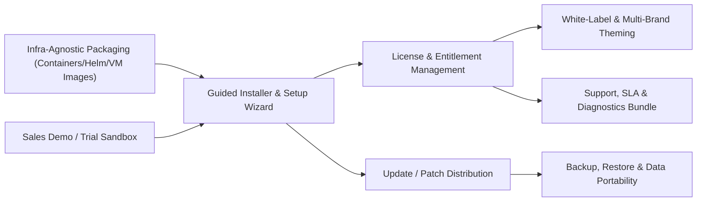

# Pillar 8: Productization, Licensing & Customer-Deployed Operability PRD

**Document Version:** 1.0.0  
**Domain:** Packaging & Installers, License/Entitlement Management, White-Labeling, Customer-Infrastructure Deployment, Update Distribution, Support & Sales Enablement  
**Owner:** Senior Product Owner – Commercial Platform & Go-to-Market Engineering  

---

## 1. Module Overview & Business Value

This platform is **sold as a product, not operated as a hosted service**: once a deal closes, the buyer (a gym chain, franchisor, or independent studio group) deploys the application stack onto **their own infrastructure** — their cloud account, their data center, or a regional hosting provider of their choice. This is a fundamentally different commercialization model than a multi-tenant SaaS, and it introduces an entire pillar of requirements that none of Pillars 1–6 address: the software must be **infrastructure-agnostic, self-installable, independently updatable, licensable/entitlement-enforced, white-labelable, and supportable without the vendor having direct production access.**

Without this pillar, the platform is a feature-complete application but **not actually sellable** — there is no way to package it, license it, hand it to a customer's IT team, or monetize it predictably post-sale.

### Key Objectives:
- Reduce time from signed contract to a working customer production environment from an ad-hoc/manual effort to **≤ 2 business days** using a scripted installer.
- Support deployment on **any major cloud (AWS/Azure/GCP), on-prem data center, or regional hosting provider** with zero code changes — only environment configuration.
- Enforce license entitlements (studio count, member-seat caps, feature-tier unlocks) with **zero backend dependency on vendor-hosted infrastructure** for core gym operations (turnstile access must never fail because of a vendor-side outage).
- Ship product updates/patches that a customer's IT administrator can apply **self-service**, with a documented rollback path.
- Provide a fully functional **sales demo/trial sandbox** that a prospect can evaluate before any infrastructure commitment.

---

## 2. Core Functional Epics & Feature Specifications



### Epic 8.1: Infrastructure-Agnostic Packaging
1. **Containerized Distribution:** The full stack (API, UI, database, background workers) ships as versioned container images with a reference **Docker Compose** bundle (small studio / single-location deployments) and a **Helm chart** for Kubernetes (multi-location/enterprise franchise deployments).
2. **Cloud-Agnostic Infra-as-Code Templates:** Reference Terraform modules for AWS, Azure, and GCP covering compute, managed database, object storage (for photos/QR assets), and networking — provided as optional accelerators, not hard dependencies, since customers may use their own provisioning standards.
3. **On-Prem / Air-Gapped Support:** A documented offline installation path (pre-downloaded image bundle + offline license activation file) for customers whose compliance policies prohibit outbound internet access from gym-facility servers (common for access-control/turnstile hardware networks).
4. **Minimum Infra Specification Sheet:** Published hardware/VM sizing guidance (CPU/RAM/storage/network) per deployment scale tier (Single Studio, Multi-Studio Franchise, Enterprise Network) so a customer's IT team can provision correctly before installation day.

---

### Epic 8.2: Guided Installer & First-Run Setup Wizard
1. **Scripted Installer:** A CLI/TUI installer validates infra prerequisites (DB connectivity, TLS certs, DNS), applies database migrations, and seeds the initial `Studio` record.
2. **First-Run Configuration Wizard:** Walks the customer's designated admin through studio branding upload, initial admin user creation, payment-processor API key entry, and turnstile/hardware vendor selection — no direct vendor engineering involvement required for a standard deployment.
3. **Environment Promotion Path:** Supports a clean Dev → Staging → Production promotion pattern within the customer's own infrastructure, with configuration-as-code (not manual re-entry) between environments.

---

### Epic 8.3: License & Entitlement Management
1. **License Tiers & Packaging:** Defines commercial SKUs (e.g., `STARTER` — single studio, capped member count; `GROWTH` — multi-studio franchise, cross-gym collaboration unlocked; `ENTERPRISE` — unlimited studios, white-label, API/webhook access) each mapping to feature flags across Pillars 1–6.
2. **Offline-First License Enforcement:** A cryptographically signed license file (not a live phone-home check) governs entitlements, since the vendor has no network access to the customer's production environment. The license file encodes studio-count caps, member-seat caps, feature-tier flags, and an expiration/renewal date.
3. **Graceful Degradation on Expiry:** If a license lapses (non-renewal), the platform **never blocks member turnstile access or safety-critical functions** — it instead restricts administrative actions (e.g., new studio creation, new feature configuration) and displays a renewal prompt to the admin, preserving goodwill and avoiding reputational risk to the vendor.
4. **Usage Telemetry for Renewal Conversations (Opt-In):** Anonymized, aggregate usage metrics (active member count, feature adoption) can be optionally exported by the customer and shared with the vendor's account team to inform renewal/upsell conversations — strictly opt-in, never silently transmitted off customer infrastructure.

---

### Epic 8.4: White-Label & Multi-Brand Theming
1. **Brand Configuration Layer:** Logo, color palette, typography, app name, and wallet-pass branding are externalized into a theme configuration object, not hardcoded — allowing each customer's deployment to look like *their* product, not a visibly third-party tool.
2. **Custom Domain & Email Sending Identity:** Customer can bind their own domain (`app.anytownfitness.com`) and configure their own transactional email/SMS sending identity so member communications appear to originate from the gym brand, not the vendor.

---

### Epic 8.5: Update, Patch & Version Lifecycle Management
1. **Semantic Versioned Releases:** Vendor publishes versioned release bundles with changelogs, categorized as `PATCH` (security/bugfix, recommended immediate apply), `MINOR` (new features, backward compatible), `MAJOR` (breaking changes, requires migration review).
2. **Self-Service Update Application:** Customer's IT admin pulls and applies updates via the same installer tooling used for initial setup, with automated pre-update backup and a documented one-command rollback.
3. **Deprecation & Long-Term Support (LTS) Policy:** Published support matrix defining how long each major version receives security patches, giving customers a predictable upgrade-planning horizon.

---

### Epic 8.6: Backup, Restore & Data Portability
1. **Automated Backup Scheduling:** Built-in scheduled backups of the database and configuration to customer-designated storage (their own S3 bucket/equivalent) — the vendor never holds a copy of customer production data.
2. **Disaster Recovery Runbook:** Documented restore procedure with a defined Recovery Point Objective (RPO ≤ 24h default, configurable) and Recovery Time Objective (RTO ≤ 4h default) that the customer's IT team can execute independently.
3. **Full Data Export:** A documented, versioned export format (so customers are never locked in) covering members, bookings, financial ledgers, and maintenance history.

---

### Epic 8.7: Sales Demo / Trial Sandbox & Diagnostics Bundle
1. **One-Click Trial Sandbox:** A disposable, pre-seeded demo environment (reusing the existing seed-data pattern already in the `database/seeds/` scaffold) that sales engineers or prospects can spin up in minutes to evaluate the product before any infrastructure commitment.
2. **Support Diagnostics Bundle:** A self-service "generate support bundle" admin action that packages sanitized logs, version info, and config (secrets redacted) for the customer to send to vendor support when filing a ticket — since the vendor cannot directly access customer infrastructure.
3. **Tiered Support & SLA Contracts:** Defines commercial support tiers (Business Hours Email, 24/7 Critical-Severity Phone, Dedicated Customer Success) independent of the hosting/deployment itself.

---

## 3. Data Models & Schemas

### 3.1 License File (`LicenseEntitlement`)
```json
{
  "$schema": "https://json-schema.org/draft/2020-12/schema",
  "title": "LicenseEntitlement",
  "type": "object",
  "properties": {
    "licenseId": { "type": "string", "format": "uuid" },
    "customerName": { "type": "string", "example": "Anytown Fitness Holdings LLC" },
    "sku": { "type": "string", "enum": ["STARTER", "GROWTH", "ENTERPRISE"] },
    "maxStudios": { "type": "integer", "example": 5 },
    "maxActiveMembers": { "type": "integer", "example": 10000 },
    "featureFlags": {
      "type": "object",
      "properties": {
        "crossGymCollaboration": { "type": "boolean" },
        "perksMarketplace": { "type": "boolean" },
        "whiteLabel": { "type": "boolean" },
        "apiAccess": { "type": "boolean" }
      }
    },
    "issuedAt": { "type": "string", "format": "date-time" },
    "expiresAt": { "type": "string", "format": "date-time" },
    "signature": { "type": "string", "description": "Cryptographic signature (vendor private key) validated offline by the deployed instance's public key." }
  },
  "required": ["licenseId", "customerName", "sku", "expiresAt", "signature"]
}
```

### 3.2 Deployment Registration (`DeploymentInstance`)
```json
{
  "instanceId": "dep_7a21c",
  "customerName": "Anytown Fitness Holdings LLC",
  "deploymentTarget": "AWS_SELF_HOSTED",
  "platformVersion": "2.4.1",
  "installedAt": "2026-11-03T09:00:00Z",
  "lastSelfReportedHealthCheck": "2026-12-01T06:00:00Z",
  "licenseId": "lic_9912a"
}
```

---

## 4. User Stories & Acceptance Criteria (Gherkin Format)

### Scenario 1: Customer IT Admin Deploys to Their Own AWS Account
```gherkin
Feature: Self-Service Deployment to Customer Infrastructure
  As a customer's IT administrator
  I want to install the platform into our own AWS account using the provided tooling
  So that we retain full control of our infrastructure and data after purchase

  Scenario: Successful fresh installation
    Given I have provisioned infrastructure meeting the published minimum specification
    And I have received a signed license file from the vendor for the "GROWTH" SKU
    When I run the guided installer against our environment
    Then the installer should validate database connectivity and TLS configuration
    And the first-run setup wizard should let me configure branding and create the initial admin user
    And the platform should report "Installation Complete" with the license entitlements active
    And no connection back to vendor-hosted infrastructure should be required for the platform to operate
```

### Scenario 2: License Expiration Graceful Degradation
```gherkin
Feature: Non-Disruptive License Expiration Handling
  As a studio operator whose renewal is delayed
  I want member access to continue working
  So that a billing/contract delay never locks my members out of the gym

  Scenario: License expires without renewal
    Given our license "expiresAt" date has passed with no renewed license file applied
    When a member taps their wallet pass at the turnstile
    Then access should still be granted normally based on their membership status
    But the admin dashboard should display a persistent "License Renewal Required" banner
    And administrative actions like creating a new studio location should be blocked
    And this restriction should lift immediately upon applying a renewed license file
```

### Scenario 3: Self-Service Patch Update with Rollback
```gherkin
Feature: Self-Service Platform Update
  As a customer's IT administrator
  I want to apply a vendor-published patch release myself
  So that I don't need to wait on vendor engineering access to our environment

  Scenario: Patch update applied successfully with automatic pre-update backup
    Given a new "PATCH" release 2.4.2 is published with a documented changelog
    When I run the installer's update command pointed at release 2.4.2
    Then an automated backup should be taken before any migration runs
    And the platform should report the new version after successful migration
    And if the update fails health checks, I should be able to run the rollback command
    And the rollback should restore the pre-update backup and prior version
```

---

## 5. Operational & Commercial Dashboard KPIs

1. **Time-to-First-Production-Deploy:** Elapsed business days from signed contract to a live customer production environment (Target: ≤ 2 business days).
2. **Self-Service Update Adoption Rate (%):** % of customer deployments on the current or immediately prior minor version within 30 days of release (Target: ≥ 80%), indicating the update process is low-friction enough to drive adoption.
3. **License Renewal Rate (%):** % of expiring licenses renewed before or within a grace window, tracked per SKU tier.
4. **Support Ticket Resolution Time by Tier:** Measured against the committed SLA per support contract tier.
5. **Trial Sandbox → Signed Deal Conversion Rate (%):** Measures sales-engineering effectiveness of the demo sandbox funnel.

---

## 6. Architectural Implication for Pillar 5 (Cross-Gym Collaboration)

Because each customer deployment is **isolated on its own infrastructure**, cross-studio roaming/settlement (Pillar 5) only works natively **within a single customer's own multi-location deployment** out of the box. True cross-*customer* roaming (e.g., Member of Gym Chain A roaming into independently-deployed Gym Chain B) requires an **optional, separately-sold, vendor-hosted "Network Hub" add-on service** that different customer deployments can choose to connect to via the API/webhook layer (Epic 8.1/8.3). This must be explicitly optional and clearly disclosed as the one component that is NOT self-hosted by the customer, since it inherently requires a shared, vendor-operated rendezvous point between independently deployed instances. See the updated note in [`05_across_gym_collaboration.md`](file:///c:/Source/antigravitytest/product%20requirement/05_across_gym_collaboration.md).
