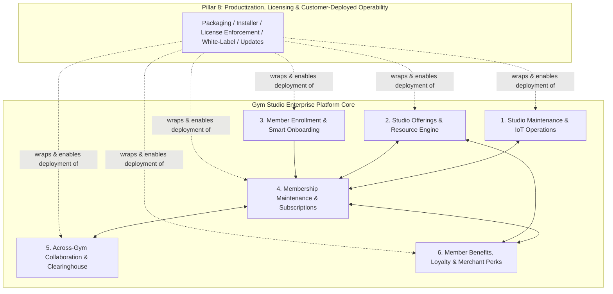
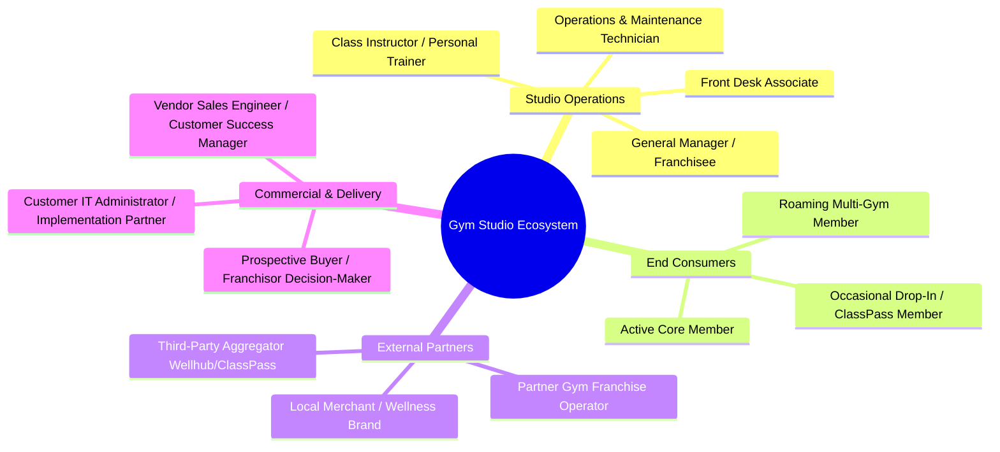
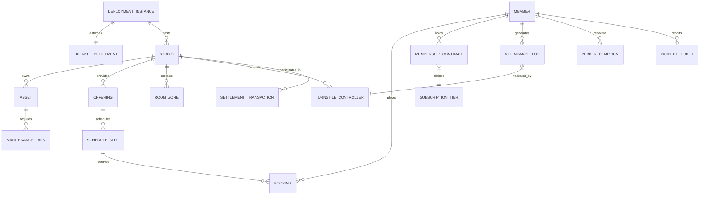

# Gym Studio Enterprise Platform: Master Product Requirements Document (PRD)

**Document Version:** 1.0.0  
**Author:** Senior Product Owner / Director of Fitness Product  
**Status:** Approved for Implementation  
**Target Release:** Multi-Phase Iterative Delivery (Phases 0 – 6)  
**Target Audience:** Engineering Leads, Product Managers, UI/UX Designers, Studio Operations Stakeholders, Franchise Partners, Sales Engineers & Customer Implementation Teams

---

## 1. Executive Summary & Product Vision

### 1.1 Product Vision
To build a modern, omnichannel, modular Gym & Fitness Studio Management Platform that unifies end-to-end studio operations: from front-of-house member acquisition and digital smart passes to back-of-house IoT facility maintenance, multi-location gym collaboration clearinghouses, and gamified member loyalty ecosystems.

### 1.1.1 Commercialization Model
This is **not** operated by the vendor as a hosted multi-tenant SaaS. It is built, licensed, and **sold as a product**: once a sales deal closes, the vendor hands the buyer a versioned, containerized release plus a signed license file, and the buyer's own IT team (or the vendor's professional-services team, as a paid service) deploys and operates the stack on **the buyer's own infrastructure** (their cloud account, data center, or hosting provider of choice). This has load-bearing implications across every pillar — the platform must be infrastructure-agnostic, self-installable, offline-license-enforced, white-labelable, and independently updatable without the vendor holding production access to customer data. These requirements are captured in full in **Pillar 8** (§4).

### 1.2 Core Problem Statement
Traditional gym management platforms (e.g., legacy systems like Mindbody, ABC Fitness, ClubReady) suffer from significant operational fragmentation:
1. **Siloed Maintenance:** Equipment breakdowns are reported informally via sticky notes or verbal reports, leading to prolonged equipment downtime (MTTR > 14 days), frustrated members, and safety liabilities.
2. **Frictional Enrollment:** Onboarding is often paper-heavy or relies on outdated web forms with disconnected payment processing, causing high drop-off (> 35% on digital funnels).
3. **Rigid Membership Lifecycle:** Members struggle to self-manage freezes, tier changes, or cancellations, resulting in high front-desk overhead and billing disputes.
4. **Isolated Multi-Studio Operations:** Franchises and independent studios lack an automated, trustless clearinghouse mechanism to allow members to cross-roam between locations while accurately settling usage fees.
5. **Shallow Member Retention:** Member perks are either non-existent or disconnected from local merchant ecosystems, resulting in standard industry annual churn rates exceeding 40%.

### 1.3 Solution Architecture Matrix
This platform solves these challenges through six integrated operational pillars, wrapped by a seventh commercialization pillar that makes the whole stack sellable and independently deployable:

---

## 2. Key Business Objectives & Target Metrics (OKRs)

| Metric Category | Baseline (Industry Average) | Target (Platform Target) | Measurement Method |
|---|---|---|---|
| **Member Digital Conversion** | 18% from lead to paid member | **≥ 38%** | Self-serve onboarding funnel analytics |
| **Equipment MTTR (Downtime)** | 12 - 16 days average | **≤ 48 hours** | Maintenance ticketing lifecycle |
| **Annual Member Churn** | 35% - 45% annually | **≤ 18% annually** | Monthly subscription cohort tracking |
| **Front-Desk Admin Hours** | 25 hrs/week per location | **≤ 6 hrs/week** | Automated check-in, billing & waiver logs |
| **Multi-Location Roaming Adoption** | < 5% cross-studio visits | **≥ 22% network usage** | Cross-gym clearinghouse ledger |
| **Perk & Benefit Engagement** | < 10% perk redemption | **≥ 45% monthly active engagement** | Merchant QR scans and loyalty points spent |
| **Time-to-First-Production-Deploy** | N/A (new capability) | **≤ 2 business days** from signed contract | Installer completion telemetry (Pillar 8) |
| **Self-Service Update Adoption** | N/A (new capability) | **≥ 80%** of deployments on current/prior minor version within 30 days | Version check-in on opt-in telemetry (Pillar 8) |

---

## 3. User Personas & Ecosystem Stakeholders

### Persona 1: Marcus – The General Manager & Franchisee
- **Role:** Oversees studio P&L, staff scheduling, retention metrics, and equipment uptime.
- **Pain Points:** Needs real-time visibility into MRR, class capacity utilization, overdue dunning balances, and repair costs across equipment assets.
- **Goals:** Single-pane-of-glass dashboard for all operational KPIs, automated staff payroll splits, and audit-ready financial settlement.

### Persona 2: Elena – The Head Maintenance & Facilities Tech
- **Role:** Responsible for preventive maintenance, equipment repairs, HVAC filters, and safety compliance.
- **Pain Points:** Learns of broken cable machines days after the failure; lacks a centralized log of warranty dates and spare parts inventory.
- **Goals:** Instant incident alerts with QR-code equipment scanning, automated work orders, and vendor dispatching.

### Persona 3: Sarah – The Dedicated Studio Member
- **Role:** High-frequency gym-goer attending group spin classes and using free weights 4x weekly.
- **Pain Points:** Forgets plastic key fob, suffers long waitlists for spin classes, unable to freeze membership quickly when traveling.
- **Goals:** Frictionless Apple/Google Wallet pass, 1-click class booking, transparent freeze/upgrade options, and local perks (e.g., 20% off juice bar next door).

### Persona 4: Liam – The Roaming / Traveling Member
- **Role:** Business consultant traveling across cities wanting to workout at partner or franchise gym locations.
- **Pain Points:** Paying double drop-in fees or filling out redundant paper liability waivers at each gym branch.
- **Goals:** Universal Gym Passport with automated access verification and zero front-desk friction.

### Persona 5: Priya – The Customer IT Administrator / Implementation Partner
- **Role:** Owns the technical deployment of the platform after a sales deal closes — provisions infrastructure, runs the installer, configures branding, applies license files, and manages ongoing updates.
- **Pain Points:** Historically forced to depend on vendor engineering access for installation and upgrades; worried about data residency, vendor lock-in, and whether the product can run in her organization's existing cloud account without bespoke rework.
- **Goals:** A documented, scripted, self-service deployment and update path; full data export portability; confidence that core member/turnstile operations never depend on vendor-hosted infrastructure being reachable.

### Persona 6: David – The Vendor Sales Engineer / Customer Success Manager
- **Role:** Runs product demos, manages trial sandboxes, negotiates license tiers, and supports renewal conversations after a deployment goes live.
- **Pain Points:** Needs a disposable, realistic trial environment that doesn't require a full infrastructure conversation before a prospect can evaluate the product; needs visibility into license expirations and (opt-in) usage signals to drive renewal conversations without direct access to customer infrastructure.
- **Goals:** A one-click sales demo sandbox, clear SKU/feature-tier packaging, and a license-management workflow that doesn't require him to log into customer production systems.

---

## 4. Documentation Structure

This Product Requirements Document (PRD) suite is modularized into specialized domain specifications located in this directory:

| Document | File | Core Focus |
|---|---|---|
| **Pillar 1** | [`01_gym_studio_maintenance.md`](file:///c:/Source/antigravitytest/product%20requirement/01_gym_studio_maintenance.md) | Asset inventory, preventive maintenance, IoT telemetry, cleaning logs, incident ticketing & smart turnstile integration. |
| **Pillar 2** | [`02_gym_studio_offerings.md`](file:///c:/Source/antigravitytest/product%20requirement/02_gym_studio_offerings.md) | Group fitness, personal training (PT), recovery room bookings, pro-shop retail POS & dynamic workshops. |
| **Pillar 3** | [`03_members_enrollment.md`](file:///c:/Source/antigravitytest/product%20requirement/03_members_enrollment.md) | Omnichannel onboarding, digital waivers (PAR-Q), identity verification, credit card tokenization & digital wallet pass provisioning. |
| **Pillar 4** | [`04_membership_maintenance.md`](file:///c:/Source/antigravitytest/product%20requirement/04_membership_maintenance.md) | Subscription tiers, freeze/pause rules, upgrades/downgrades, cancellations, dunning engine & family/corporate accounts. |
| **Pillar 5** | [`05_across_gym_collaboration.md`](file:///c:/Source/antigravitytest/product%20requirement/05_across_gym_collaboration.md) | Multi-location roaming, inter-studio clearinghouse & financial settlement, partner gym networks & aggregator APIs. |
| **Pillar 6** | [`06_members_benefits_and_perks.md`](file:///c:/Source/antigravitytest/product%20requirement/06_members_benefits_and_perks.md) | Gamification streaks, tiered loyalty perks, local merchant partner marketplace, referral engine & wellness insurance credits. |
| **Roadmap** | [`07_iterative_implementation_roadmap.md`](file:///c:/Source/antigravitytest/product%20requirement/07_iterative_implementation_roadmap.md) | Phase-by-phase delivery plan (Phase 0 through Phase 6), milestone gates, sprint schedules, resource allocation, risk mitigation & the consolidated **Product Build Plan**. |
| **Pillar 8** | [`08_productization_licensing_deployment.md`](file:///c:/Source/antigravitytest/product%20requirement/08_productization_licensing_deployment.md) | Infra-agnostic packaging & installers, offline license/entitlement enforcement, white-labeling, self-service updates, backup/data portability, sales demo sandbox & support SLAs — the requirements that make this an independently sellable, customer-deployed product rather than a vendor-hosted service. |

---

## 5. System Architecture & High-Level Domain Model

---

## 6. Global Non-Functional Requirements (NFRs)

### 6.1 Security & Compliance
1. **PCI-DSS Level 1 Compliance:** No raw credit card or bank account data is stored on platform servers. All payment flows must use tokenized vaults via Stripe, Adyen, or Braintree.
2. **HIPAA & GDPR / CCPA:** Medical questionnaire responses (PAR-Q health forms) must be encrypted at rest (AES-256) and segregated from general marketing profile data.
3. **Audit Trails:** All contract signing, waiver acceptances, membership status transitions, and monetary adjustments must generate immutable append-only audit logs.

### 6.2 Performance & Availability
1. **Turnstile / Access Control Latency:** Access control decisions (RFID/NFC/QR scan) must resolve in **< 300 milliseconds** end-to-end to prevent queuing at entry gates.
2. **Offline-First Resilience:** In the event of WAN/internet outage, local IoT controllers must validate recent active member passes from local cache for up to 72 hours.
3. **Core API Latency:** 95th percentile API response time must remain **< 150ms** under peak morning (06:00 - 08:30) and evening (17:00 - 20:00) traffic spikes.
4. **Availability SLA:** 99.95% system uptime for member-facing mobile applications and back-office management portals.

### 6.3 Deployability & Vendor Independence (Pillar 8)
1. **No Vendor-Hosted Hard Dependency:** Core safety/access-critical functions (turnstile entry, member check-in, billing) must never depend on reachability of any vendor-operated infrastructure — license enforcement is offline-file-based, not a live phone-home check.
2. **Infrastructure Agnosticism:** The platform must run unmodified across AWS, Azure, GCP, on-prem data centers, and air-gapped environments using the same container images, differing only in environment configuration.
3. **Customer Data Sovereignty:** The vendor never holds a standing copy of customer production data; backups are written to customer-designated storage only.
